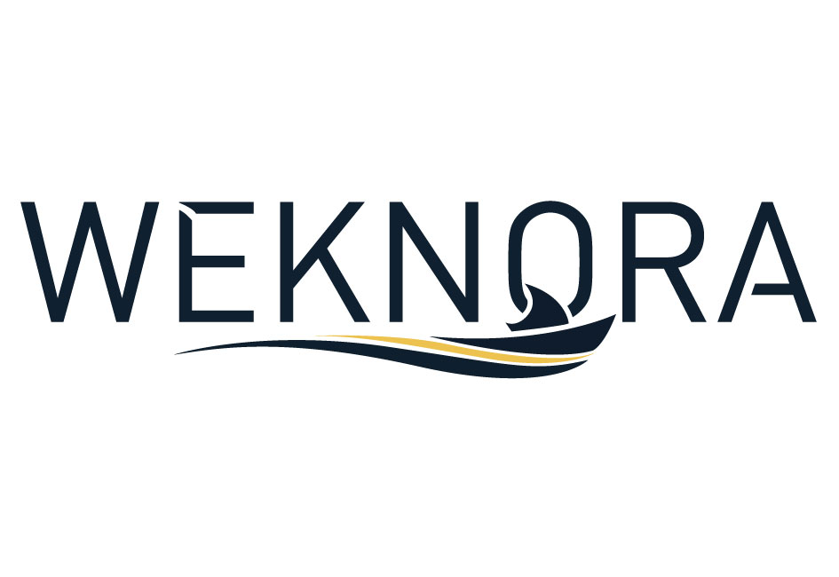
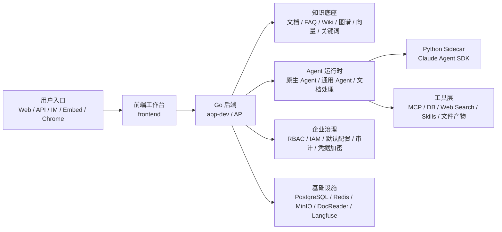

<p align="center">
  
</p>

<p align="center">
  
  
  
  
</p>

# WeKnora 企业级 Agent 知识库平台

本仓库是基于 WeKnora 深度二开的企业级 Agent 知识库平台。它不只是一个 RAG 问答系统，而是面向企业内部知识沉淀、智能体编排、数据分析、办公文档处理和多渠道发布的一体化工作台。

平台以知识库为可信信息底座，以智能体为业务入口，把文档、FAQ、Wiki、外部内容源、数据库、MCP 工具、技能包、定时任务和企业身份体系连接起来。企业可以用它搭建制度问答、客服助手、销售/经营数据分析、文档生成、行业研究、内部门户客服、IM 机器人和自动报告等场景。

## 当前开发入口

| 服务 | 地址 | 说明 |
| --- | --- | --- |
| 前端开发服务 | `http://localhost:5177` | 位于 `frontend/`，当前开发环境使用该入口访问界面。 |
| 后端 API | `http://localhost:8080` | Docker Desktop 中 `app-dev` 容器对外端口。 |
| 通用智能体 Sidecar | `http://127.0.0.1:8091/health` | Claude Agent SDK 运行时。 |
| 文档处理智能体 Sidecar | `http://127.0.0.1:8093/health` | 预装 LibreOffice、Pandoc、PDF 和 Office 处理依赖。 |
| Langfuse | `http://localhost:3000` | 启用 profile 后可查看链路追踪。 |

## 平台定位

WeKnora 的企业二开版本围绕四个核心目标建设：

| 目标 | 平台能力 |
| --- | --- |
| 让企业知识可检索、可引用、可治理 | 文档知识库、FAQ、Wiki、图谱、标签、批量重解析、解析时间线、来源引用。 |
| 让 Agent 能完成真实业务任务 | 快速问答、智能推理、通用智能体、数据分析智能体、文档处理智能体、MCP、技能和联网搜索。 |
| 让企业资源安全协作 | 多租户 RBAC、共享空间、资源共享、统一身份认证、默认配置中心、审计和凭据加密。 |
| 让能力可以被业务系统复用 | API、网页嵌入、IM 渠道、Chrome 插件、ClawHub 技能、定时任务。 |

## 适用场景

| 场景 | 推荐方案 |
| --- | --- |
| 制度、流程、产品手册问答 | 文档知识库 + 快速问答或 RAG 智能体，回答必须带引用。 |
| 客服或标准口径问答 | FAQ 知识库 + FAQ 优先策略 + 推荐问题。 |
| 大量长文档结构化阅读 | Wiki 知识库 + Wiki 问答 + 页面链接图谱。 |
| 企业经营数据分析 | MySQL/PostgreSQL 数据源 + 数据分析智能体 + 图表/报告输出。 |
| 生成 Word、Excel、PDF、PPT | 文档处理智能体 + 企业模板 + 专业技能。 |
| 复杂业务编排 | 通用智能体 + 知识库 + 数据库 + MCP + 联网搜索 + 产物生成。 |
| 每日/每周自动报告 | 定时任务 + 绑定智能体 + 固定上下文和提示词模板。 |
| 网站、IM、业务系统集成 | 网页嵌入、API Principal、企业微信/飞书/Slack/Telegram 等 IM 渠道。 |

## 核心能力

### 1. 企业知识库

- 支持文档知识库、FAQ 知识库和 Wiki 能力。
- 支持 PDF、Word、Excel、PPT、Markdown、HTML、EPUB、MHTML、图片、音频、CSV、JSON 等资料。
- 支持文件上传、文件夹上传、URL 导入、在线 Markdown、外部数据源同步。
- 支持飞书、Notion、语雀、RSS 等内容源同步到知识库。
- 支持向量检索、关键词检索、父子分块、Rerank、FAQ 优先、GraphRAG、Wiki 页面和知识图谱。
- 支持上传确认时覆盖解析配置，包括解析器、分块、多模态、ASR、图谱和问题生成。
- 支持批量删除、批量重解析、标签筛选、解析状态和解析时间线。

### 2. Agent 工作台

平台内置多类智能体，可直接使用，也可以复制后改造成业务智能体：

| 智能体 | 用途 |
| --- | --- |
| 快速问答 | 稳定 RAG 问答，适合制度、手册、知识库查询。 |
| 简单对话 | 通用对话、写作、临时文件和图片问题。 |
| 智能推理 | ReAct 多步推理，编排知识库、工具、MCP 和联网搜索。 |
| 维基问答 | 面向 Wiki 页面和目录的知识问答。 |
| 深度研究 | 联网检索、资料综合和研究型问题。 |
| 数据分析 | 连接 MySQL/PostgreSQL，生成 SQL、指标解释和图表。 |
| 通用智能体 | 同时使用知识库、数据库、MCP、技能、联网搜索和产物生成。 |
| 文档处理 | 生成或修改 Word、Excel、PDF、PPT 等办公文档。 |
| 知识图谱专家 | 围绕实体关系、图谱和结构化知识分析。 |

智能体配置覆盖模型、提示词、上下文模板、知识库范围、检索参数、数据库数据源、联网搜索、多模态、工具、MCP、技能、共享和集成渠道。

### 3. 通用智能体与文档处理 Sidecar

本项目新增了 Claude Agent SDK Sidecar 运行时：

- Go 后端负责权限、租户、密钥、MCP、工具执行、检索、数据库访问和结果持久化。
- Python Sidecar 只负责 agentic loop 和动态工具调度，不直接连接 WeKnora 数据库、对象存储或 MCP 服务。
- 工具调用统一回调 Go 后端，复用原生权限、审批、OAuth、审计和安全边界。
- 通用智能体支持知识库检索、网络搜索、多模态、MCP、Skills、数据库工具和产物生成。
- 文档处理智能体使用独立镜像，预装 LibreOffice、Pandoc、PDF 工具、中文字体和常用 Office/Python 库，适合企业文档生成与转换。

### 4. 数据库分析

数据库数据源用于数据分析智能体和通用智能体，当前支持 MySQL 和 PostgreSQL：

- 管理数据源连接、测试连接、刷新表和字段元数据。
- 控制可见表范围、最大返回行数、最大扫描行数和查询超时。
- 为表和字段补充业务描述，标记维度、指标、时间字段。
- 支持敏感字段脱敏或隐藏。
- 数据源可共享到共享空间，供具备权限的成员绑定到智能体。
- 智能体运行时通过 `db_catalog`、`db_schema`、`db_query` 等只读工具查询。

### 5. 技能中心

平台支持两类技能：

- 轻量技能：以提示词形式沉淀固定写作风格、行业术语、输出模板和审校规则。
- 专业技能：以技能包形式导入，包含 `SKILL.md`、引用文件、脚本或模板，适合复杂工作流和行业方法论。

技能可以配置到智能体，也可以在对话中临时选择。技能支持共享给共享空间或指定用户。

### 6. 定时任务

定时任务会按计划自动向指定智能体提问，并把结果写入真实会话：

- 支持小时、每日、每周、每月调度。
- 支持时区、运行用户、提示词模板、变量渲染预览。
- 支持绑定知识库、文档、标签、MCP、技能、图片和附件上下文。
- 支持立即运行、运行记录、跳转会话、失败信息和并发跳过策略。
- 适合日报、周报、月报、指标监控、行业情报和知识库巡检。

### 7. 企业协作与治理

- 多租户/工作区体系，资源归属清晰。
- 租户角色：viewer、contributor、admin、owner。
- 共享空间支持跨租户共享知识库、智能体、技能和数据库数据源。
- 支持统一身份认证 SSO 和组织人员同步。
- 默认配置中心可向用户工作区下发模型、向量库、解析器、存储、联网搜索和 MCP 服务。
- 系统自动维护“使用指南”共享知识库，让新老用户都能查看平台说明。
- 答案反馈会记录点赞/点踩，并保存运行快照，便于后续质量分析。
- 支持审计日志、凭据 AES-256-GCM 加密、SSRF 防护、MCP OAuth 和工具审批。

### 8. 集成发布

| 入口 | 说明 |
| --- | --- |
| REST API | 支持 API Key 和登录态调用，`agent-chat` 使用 SSE 流式响应。 |
| API Principal | 支持 tenant、direct_header、signed_token，隔离外部用户会话和 MCP OAuth。 |
| 网页嵌入 | 支持 iframe、Widget、安全模式 token exchange、域名白名单和限流。 |
| IM 渠道 | 支持企业微信、飞书、Slack、Telegram、钉钉、Mattermost、微信、QQBot。 |
| Chrome 插件 | 支持网页侧边栏问答、网页剪藏、Markdown 笔记和离线包安装。 |
| ClawHub | 通过 `@lyingbug/weknora` 技能接入上传、URL 导入和混合搜索能力。 |

## 架构概览



二开边界遵循 [二开目录结构规范](./docs/custom/二开目录结构规范.md)：

- 后端二开模块位于 `internal/custom/modules/`。
- 后端统一注册点位于 `internal/custom/bootstrap/`。
- 前端二开页面与模块位于 `frontend/src/custom/modules/`。
- 旁路服务位于 `custom/services/`。
- 自定义迁移参考位于 `migrations/custom/`。
- 原生代码只保留必要注册点、路由挂载、Hook 和类型字段。

## 本地开发启动

### 环境要求

- Docker Desktop
- Docker Compose
- Go
- Node.js / npm

### 启动基础设施

```bash
cp .env.example .env
make dev-start
```

按需追加 profile：

```bash
make dev-start DEV_ARGS="--minio --qdrant --neo4j"
make dev-start DEV_ARGS="--full"
```

### 启动后端容器

```bash
docker compose -f docker-compose.dev.yml -f docker-compose.dev.app.yml up -d --build app-dev
```

后端访问地址：

```text
http://localhost:8080
```

### 启动智能体 Sidecar

```bash
docker compose -f custom/docker-compose.general-agent.yml up -d --build
```

健康检查：

```bash
curl http://127.0.0.1:8091/health
curl http://127.0.0.1:8093/health
```

### 启动前端

```bash
cd frontend
npm install
npm run dev -- --host 0.0.0.0 --port 5177
```

前端访问地址：

```text
http://localhost:5177
```

### 修改后重启

本项目要求修改后重新拉起受影响容器。常用命令：

```bash
docker compose -f docker-compose.dev.yml -f docker-compose.dev.app.yml stop app-dev
docker compose -f docker-compose.dev.yml -f docker-compose.dev.app.yml rm -f app-dev

docker compose -f docker-compose.dev.yml -f docker-compose.dev.app.yml up -d --build app-dev
docker compose -f custom/docker-compose.general-agent.yml up -d --build
```

如果只改前端代码，重启前端开发服务即可；如果改 Go 后端、Sidecar、Dockerfile、环境变量或依赖，必须重新拉起对应容器。

## 配置与安全注意事项

- 生产环境不要把 API Key、嵌入发布 Token、模型密钥或数据库密码放到浏览器或静态包。
- 对公网网页嵌入建议使用安全模式，业务后端代持发布 Token，并换取短期 `ems_` 会话 Token。
- 数据库分析只应开放必要表和字段，敏感字段设置为脱敏或隐藏。
- MCP 有副作用或高风险工具应开启审批。
- 统一身份认证部署在反向代理后时，需要正确透传 `Host`、`X-Forwarded-Host`、`X-Forwarded-Proto`。
- 修改二开逻辑前先阅读 [二开目录结构规范](./docs/custom/二开目录结构规范.md)，避免把大段业务代码散落到原生目录。

## 重要文档

| 文档 | 内容 |
| --- | --- |
| [用户使用指南](./docs/custom/使用指南/用户使用指南.md) | 面向平台使用者、知识库维护者、空间管理员和系统管理员。 |
| [智能体开发指南](./docs/custom/使用指南/智能体开发指南.md) | 面向智能体配置、调试、发布和集成开发。 |
| [通用智能体方案](./docs/custom/通用智能体方案.md) | 通用智能体与 Claude Agent SDK Sidecar 的实现基准。 |
| [统一身份认证与默认配置说明](./docs/custom/统一身份认证与默认配置实现说明.md) | IAM、SSO、组织同步和默认配置中心。 |
| [二开目录结构规范](./docs/custom/二开目录结构规范.md) | 二开代码目录、注册点和命名约束。 |
| [API 文档](./docs/api/README.md) | REST API 说明。 |
| [MCP 配置说明](./mcp-server/MCP_CONFIG.md) | MCP 服务接入配置。 |
| [常见问题](./docs/QA.md) | 运行和排错参考。 |

## 开发约定

- API 前缀统一使用 `/api/v1/custom/<module>/*`。
- 二开表名前缀使用 `custom_<module>_*`。
- 二开环境变量前缀使用 `CUSTOM_<MODULE>_*`。
- 新增后端模块优先放入 `internal/custom/modules/<module>/`。
- 新增前端模块优先放入 `frontend/src/custom/modules/<module>/`。
- 可独立运行的大段能力优先放入 `custom/services/<module>/`。
- 二开 migration 编号从 `900000` 以后开始。
- 当前开发环境不要求兼容旧二开实现、旧数据库、旧存储或旧配置，禁止为了兼容旧实现而降级新能力。

## License

本项目沿用 WeKnora 原始开源协议，详见 [LICENSE](./LICENSE)。
