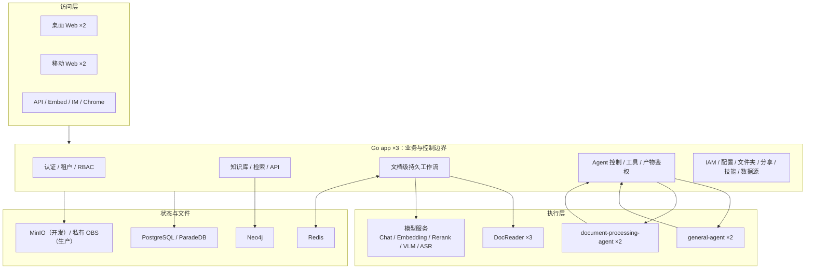
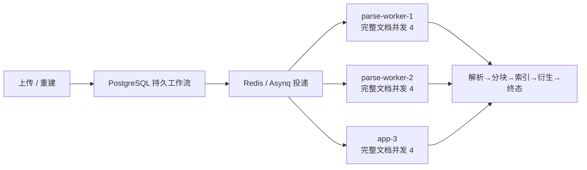

<p align="center">
  
  
  
  
  
</p>

# WeKnora Agent 企业知识平台

本仓库是基于 WeKnora 深度二开的企业知识与智能体平台。当前版本已经不只是单
实例 RAG 服务：它提供可水平扩展、可恢复的完整文档解析工作流，支持文档、向量、
Wiki、知识图谱、问题生成、多模态和音频处理，并把知识检索、数据分析、办公文档
生成、企业身份与多渠道发布统一到同一平台。

> 当前代码的完整架构、状态语义、生产拓扑和文档地图见
> [当前实现架构与文档索引](./docs/custom/当前实现架构与文档索引.md)。
> 当前生产版本、资源和并发的第一权威说明是
> [当前生产实现与部署基线](./docs/custom/当前生产实现与部署基线.md)。生产人员请从
> [当前版本生产更新部署执行手册](./docs/custom/当前版本生产更新部署执行手册.md)
> 开始，不能只使用上游 WeKnora 的部署说明或默认 Helm 值。

## 当前开发入口

| 服务 | 地址 | 说明 |
|---|---|---|
| 桌面前端 | `http://localhost:5177` | `frontend/` 开发服务 |
| 后端 API | `http://localhost:8080` | Docker Desktop 的 `app-dev` |
| general-agent | `http://127.0.0.1:8091/health` | 通用/数据/表格智能体旁路运行时 |
| document-processing-agent | `http://127.0.0.1:8093/health` | Word、Excel、PDF、PPT 处理运行时 |
| Langfuse | `http://localhost:3000` | 启用对应 profile 后可用 |

## 平台能力

| 领域 | 当前能力 |
|---|---|
| 企业知识 | 文档、FAQ、Wiki、文件夹、URL、手工 Markdown、外部内容源 |
| 文档处理 | PDF、Word、Excel、PPT、网页、文本、图片、音频等；拆分、OCR、VLM、ASR |
| 索引和衍生 | chunk、向量、关键词、摘要、问题生成、实体关系图谱、Wiki 页面 |
| 检索问答 | 向量/关键词混合检索、Rerank、FAQ 优先、图谱、Wiki、来源引用 |
| 智能体 | 快速问答、简单对话、智能推理、Wiki、数据、表格、通用、文档处理 |
| 企业治理 | 多租户、RBAC、共享空间、SSO、组织同步、默认配置、审计、凭据加密 |
| 工具与数据 | MCP、技能、Web 搜索、MySQL/PostgreSQL 只读分析、定时任务 |
| 发布集成 | REST API、Embed、IM、移动 Web、Chrome 扩展、ClawHub |

### 常见业务场景

- 制度、流程、产品手册问答：文档知识库 + 快速问答，回答附来源。
- 大量长文档阅读：Wiki + 分类页面 + 渐进式关联图。
- 客服标准口径：FAQ + FAQ 优先策略 + 推荐问题。
- 经营数据分析：受限数据库源 + 数据分析智能体 + 图表/报告。
- CSV/Excel 即席分析：表格分析智能体 + 知识库文件或本轮附件。
- Word、Excel、PDF、PPT 生成：文档处理智能体 + 企业模板/技能。
- 复杂业务编排：通用智能体 + 知识库 + 数据库 + MCP + Web + 产物。
- 日报/周报/月报：定时任务 + 固定上下文 + 指定智能体。

## 架构

### 1. 组件关系


```mermaid
flowchart TB
    subgraph Access["访问层"]
        Desktop["桌面 Web ×2"]
        Mobile["移动 Web ×2"]
        External["API / Embed / IM / Chrome"]
    end

    subgraph Control["Go app ×3：业务与控制边界"]
        Auth["认证 / 租户 / RBAC"]
        KB["知识库 / 检索 / API"]
        DQ["文档级持久工作流"]
        Agent["Agent 控制 / 工具 / 产物鉴权"]
        Custom["IAM / 配置 / 文件夹 / 分享 / 技能 / 数据源"]
    end

    subgraph Execution["执行层"]
        DR["DocReader ×3"]
        GA["general-agent ×2"]
        DA["document-processing-agent ×2"]
        Model["模型服务\nChat / Embedding / Rerank / VLM / ASR"]
    end

    subgraph Data["状态与文件"]
        PG["PostgreSQL / ParadeDB"]
        Redis["Redis"]
        Object["MinIO（开发）/ 私有 OBS（生产）"]
        Neo4j["Neo4j"]
    end

    Access --> Control
    DQ --> DR
    DQ --> Model
    Agent --> GA
    Agent --> DA
    GA --> Agent
    DA --> Agent
    Control --> PG
    DQ <--> Redis
    Control --> Object
    KB --> Neo4j
```

架构的五条硬约束：

1. 同一 app 镜像按 API、parse、derivative、wiki 和 maintenance 角色运行；
   parse-worker 领取完整文档，衍生角色在同一持久工作流边界内收敛结果。
2. PostgreSQL 是文档工作流事实来源，Redis 是可重投的投递和集群准入层。
3. Go app 是权限、租户、工具、MCP、业务数据库和持久化的唯一控制边界。
4. 生产长期文件全部进入私有 OBS，app/DocReader/Agent 仅使用独立本地临时盘。
5. 完整工作流成功才显示“已完成”，不能用主解析完成掩盖 Wiki/图谱/问题失败。

### 2. 文档级水平扩展


```mermaid
flowchart LR
    In["上传 / 重建"] --> WF["PostgreSQL 持久工作流"]
    WF --> Q["Redis / Asynq 投递"]
    Q --> A1["parse-worker-1\n完整文档并发 4"]
    Q --> A2["parse-worker-2\n完整文档并发 4"]
    Q --> A3["app-3\n完整文档并发 4"]
    A1 --> P["解析→分块→索引→衍生→终态"]
    A2 --> P
    A3 --> P
```

管理员的 `asynq.concurrency` 现在表示“单个 app 同时接纳的完整文档数”。生产
使用 3 个 app、每实例 4，因此同时处理 12 份完整文档；等待文档在全局按文档
排队，哪个实例先空闲就继续领取，而不是把不同任务类型分别堆成长队列。

每份文档只有在启用项全部达到终态后才算完成：

```text
安全校验 → 原文入对象存储 → 解析/拆分 → chunk → 向量/关键词
                                      └→ 多模态/VLM/ASR
                                      └→ 摘要
                                      └→ 问题生成
                                      └→ 知识图谱
                                      └→ Wiki
                           → 完整性核验 → completed
```

文档卡片显示系统等待总量和该文档的全局位置；悬停展示各阶段的简洁明细。
`none` 表示尚未开始或等待前置阶段，不是“已跳过”。只有显式关闭、不适用或有
结构化跳过原因时才显示“已跳过”；异常必须显示失败或降级。

详细状态机、稳定实例身份、boot ID、租约、execution epoch、终止证明和竞态边界
见[文档解析水平扩展与故障恢复](./docs/custom/文档解析水平扩展与故障恢复.md)。

### 3. 重启、故障和“不重复”

- Redis/Asynq 是 at-least-once 投递；generation、epoch、稳定任务 ID 和幂等提交
  保证业务结果收敛。
- 同一稳定实例重启后可识别上一个 boot 并继续处理自己领取的文档。
- 实例心跳超时只是异常嫌疑，不能单独触发接管。
- 只有租约、boot/epoch fencing 和可用时的 Kubernetes 精确终止/节点隔离证明
  同时满足，其他实例才接管。
- 旧实例的迟到任务不能写入新的 generation/epoch。
- 解析中删除或重建会隔离旧 generation，并清理任务、chunk、索引、图谱、Wiki
  引用和对象。

这保证的是“持久接收、可恢复投递和受 fencing 的有效一次业务提交”，并不声称
外部模型调用在进程崩溃边界绝对只发生一次。

### 4. 集群级模型准入

模型和解析器并发通过 Redis 在整个集群共享，不能乘以 API/worker 副本数：

| 资源池 | 集群并发 | 交互预留 | 等待 | 单租户/单文档 |
|---|---:|---:|---:|---:|
| Qwen3.6-27B | 32 | 28 | 36 | 32 / 2 |
| DeepSeek-V4-Flash INT8 | 16 | 14 | 16 | 16 / 2 |
| Qwen3.6-35B-A3B | 32 | 8 | 0 | 32 / 4 |
| Qwen3-Embedding-8B | 64 | — | — | 32 / 8 |
| bge-reranker-v2-m3 | 64 | — | — | 64 / 2 |
| Qwen3-VL-32B | 16 | — | — | 16 / 4 |
| Qwen2.5-Omni-7B | 8 | — | — | 8 / 2 |

两个主要聊天池合计同时执行 48、等待 52，总接纳 100；100 已包含 48 个执行会话。
该设置与每个 parse-worker 的完整文档并发是两个不同层级。

### 5. 无 RWX 存储

| 内容 | 开发 | 生产 |
|---|---|---|
| 原始知识文件、衍生对象 | MinIO | 私有 OBS |
| Agent 最终产物 | MinIO | 私有 OBS |
| Agent 原文件中转 | MinIO 临时唯一前缀 | OBS 临时唯一前缀，生命周期 ≤24h |
| app/DocReader/Agent 工作区 | 容器/节点本地临时盘 | `/mnt/weknora-data/weknora-v2-scratch/<role>` 隔离 hostPath |
| 状态、chunk、向量、问题、Wiki | PostgreSQL | PostgreSQL/ParadeDB |
| 实体关系 | Neo4j | Neo4j |

生产对象键按用途使用不同的部署级、namespace UUID 级唯一前缀，默认私有。Agent
最终产物在 terminal 事件前由 app 写入对象存储并校验大小/SHA256，后续任意 app
都能鉴权下载。对象存储不能挂载成 Office/PDF 的 POSIX 工作目录。

### 6. 大规模前端交互

- 文档列表：服务端完整状态筛选，支持等待、处理中、取消中、删除中、完成、失败、
  取消、草稿；衍生失败会进入“失败”。
- 知识库文件夹：服务端分页、渐进加载和搜索，不把全库树一次性载入。
- 大文件预览：先取 preview policy，大文件分页/范围读取或下载，避免浏览器卡死。
- Wiki 图：节点按类型分类、搜索和分页；选择节点只加载其一跳邻接图；点击关联
  节点会以它为新中心继续加载，不展示整库全图。

### 7. Agent 双副本边界

`general-agent` 和 `document-processing-agent` 都支持两个或更多副本。一次 SDK
运行固定在一个 Pod 的临时工作目录；Python 旁路服务不直接连接 WeKnora 数据库、
业务数据库、MCP 或对象存储凭据。工具执行和最终产物上传都回到 Go app，因而：

- 请求不需要依赖 Agent 共享目录或粘性会话。
- 已完成产物可以从任意 app 下载。
- Agent Pod 崩溃不会损坏已提交产物；未提交运行按失败/重试处理。
- 通用、数据分析、表格分析和文档处理各自的工具及安全特点保持不变。

## 生产部署

### 目标拓扑

当前生产最优落地配置不是“第一阶段/第二阶段”方案：

| 节点 | 规格 | 目标工作负载 |
|---|---|---|
| `10.14.201.1` | 8C/32Gi + 500G | API、parse、derivative、maintenance、DocReader、两个 Agent、Web |
| `10.14.201.2` | 8C/32Gi + 500G | API、parse、wiki、maintenance、DocReader、两个 Agent、Web |
| `10.14.201.7` | 8C/32Gi + 数据盘 | API、parse、derivative、wiki、DocReader |
| `10.14.201.6` | 8C/16Gi | PostgreSQL 和集群基础设施，不新增应用 worker |
| `10.14.201.54` | 8C/16Gi | 保留 Neo4j、Ingress 等 |

| 组件 | 副本 | request | limit | 临时卷 |
|---|---:|---:|---:|---:|
| API | 3 | 500m / 1280Mi | 1500m / 3Gi | 无状态 |
| parse-worker | 3 | 1C / 2Gi | 3C / 5Gi | hostPath scratch |
| derivative-worker | 2 | 500m / 1Gi | 1500m / 2Gi | hostPath scratch |
| wiki-worker | 2 | 500m / 1Gi | 1500m / 2Gi | hostPath scratch |
| maintenance | 2 | 150m / 384Mi | 750m / 1Gi | 无 |
| DocReader | 3 | 750m / 1Gi | 4C / 4Gi | hostPath scratch |
| general-agent | 2 | 250m / 768Mi | 1500m / 2Gi | hostPath scratch |
| document-processing-agent | 2 | 500m / 1280Mi | 2500m / 4Gi | hostPath scratch |
| frontend | 2 | 0.1C / 128Mi | 0.5C / 512Mi | 无 |
| mobile-web | 2 | 0.05C / 64Mi | 0.3C / 512Mi | 无 |

大临时卷 Deployment 使用 `maxSurge=0,maxUnavailable=1`，并按主机名打散。外部
知识源原文件上限 2048 MiB；桌面/移动 Nginx 和 Ingress 的知识上传上限为
2304 MiB，关闭 request buffering，读写超时 7200 秒；Agent 内部代理上限至少
128 MiB。

### 部署与迁移入口

生产侧没有本对话上下文时，按以下顺序阅读和执行：

1. [生产部署文件入口](./deploy/production/README.md)
2. [当前版本生产更新部署执行手册](./docs/custom/当前版本生产更新部署执行手册.md)
3. [无 RWX 目标方案与容量依据](./docs/custom/生产集群无RWX最优部署方案.md)
4. [Helm Chart 说明](./helm/README.md)
5. [`helm/values-production-ha.yaml`](./helm/values-production-ha.yaml)
6. [多实例 API/E2E/故障验收](./custom/tests/document_processing_cluster_e2e/README.md)

迁移不是简单 `helm upgrade`。执行手册覆盖：

- 现网清单、配置、Secret 和 PostgreSQL 全量/停机增量备份；停机期间不变化的文件
  不重复备份，回滚继续引用原 OBS 对象。
- 排空在途文档和 Agent 运行、移除业务入口、建立回滚点。
- 构建同一 Git SHA 的 app/DocReader/Agent/Web/sandbox 镜像并推送 SWR。
- 节点标签、现有数据盘、隔离 hostPath scratch 和真实读写/清理验证。
- 单迁移 app 串行执行数据库迁移和旧 Agent 产物迁移。
- 验证历史原文、图片和 Agent 产物可由任意 API Pod 鉴权下载，且原对象未变化。
- 部署最终 3/3/2/2/2/2 副本，验证真实分流、故障接管和所有衍生任务。
- 失败时按数据库/对象/清单的一致回滚点恢复，不能只回滚 Deployment。

### 当前高可用边界

API、worker、DocReader、Agent 和 Web 层已经多副本，但现有 PostgreSQL、Neo4j
仍为单实例，Redis 主从没有自动切换，外部 llmgateway 是独立依赖，且集群仍是单
AZ。当前版本解决的是文档执行
层水平扩展、单 Pod/解析节点故障恢复和无 RWX 文件共享，不能宣称整套系统没有
单点。

## 二开目录

新增业务遵循[二开目录结构规范](./docs/custom/二开目录结构规范.md)：大段逻辑位于
`custom/`、`internal/custom/` 和 `frontend/src/custom/`，上游目录只保留必要
注册点、Hook 和少量字段。

### 后端重点模块

| 模块 | 目录 | 职责 |
|---|---|---|
| 统一注册 | `internal/custom/bootstrap/` | 二开服务、路由、迁移、调度器和 Hook |
| 文档队列 | `internal/custom/modules/documentqueue/` | 持久工作流、实例、租约、epoch、接管 |
| 模型准入 | `internal/custom/modules/modeladmission/` | Redis 集群/租户级模型与解析器并发 |
| VLM 长尾保护 | `internal/custom/modules/vlmguard/` | 流式进度超时、重复输出检测和错误归因 |
| 大文档拆分 | `internal/custom/modules/documentsplit/` | 拆分、租约、重试、采样和预算 |
| 产物存储 | `internal/custom/modules/artifactstore/` | 私有对象、校验、迁移和幂等提交 |
| 文档状态 | `internal/custom/modules/knowledgeworkflowfilter/` | 完整工作流筛选 |
| 文件夹 | `internal/custom/modules/knowledgefolders/` | 渐进目录、搜索、移动和上传 |
| 预览 | `internal/custom/modules/documentpreview/` | 大文件预览策略 |
| 生命周期 | `knowledgepurge/`、`terminalrepair/` | 删除、终态修复和跨存储清理 |
| Agent | `internal/custom/modules/generalagent/` | 工具桥、运行控制、产物和下载 |
| 企业能力 | `iam/`、`configcenter/`、`admin/` | SSO、组织、默认资源和系统管理 |
| 协作能力 | `chatshare/`、`sessionstate/`、`answerfeedback/` | 分享、已读和反馈 |
| 数据与技能 | `dbanalytics/`、`skillhub/`、`scheduledchat/` | 数据源、技能和定时任务 |

完整模块目录说明见 [`internal/custom/README.md`](./internal/custom/README.md)。

### 前端重点模块

| 目录 | 职责 |
|---|---|
| `documentQueue/` | 系统等待总量与文档位置 |
| `knowledgeWorkflowStatus/` | 完整状态、悬停明细、准确筛选 |
| `knowledgeFolders/` | 文件夹、服务端搜索和渐进加载 |
| `documentPreview/` | 大文件预览保护 |
| `wikiGraph/` | 分类、分页、中心节点切换 |
| `generalagent/`、`dbanalytics/`、`skillhub/` | Agent、数据分析和技能 |
| `iam/`、`configcenter/`、`authSecurity/` | 企业身份和配置治理 |
| `mobile/`、`chatshare/`、`sourceReferences/` | 移动端、分享和来源 |

完整说明见 [`frontend/src/custom/README.md`](./frontend/src/custom/README.md)。

## 本地开发

### 环境

- Docker Desktop / Docker Compose
- Go
- Node.js / npm

### 启动

```bash
cp .env.example .env
make dev-start
```

按需启用 profile：

```bash
make dev-start DEV_ARGS="--profile neo4j --profile minio --profile langfuse"
```

开发后端入口：

```bash
docker compose -f docker-compose.yml -f docker-compose.dev.yml up -d app-dev
curl http://localhost:8080/health
```

Agent 旁路服务：

```bash
docker compose -f docker-compose.yml -f docker-compose.dev.yml \
  --profile agent up -d general-agent document-processing-agent
curl http://127.0.0.1:8091/health
curl http://127.0.0.1:8093/health
```

前端：

```bash
cd frontend
npm ci
npm run dev -- --host 0.0.0.0 --port 5177
```

修改运行代码后，先停止本项目旧实例，再重建受影响容器；不能让旧进程和新容器
同时占用端口：

```bash
docker compose -f docker-compose.yml -f docker-compose.dev.yml stop <service>
docker compose -f docker-compose.yml -f docker-compose.dev.yml up -d --build <service>
```

仅修改 Markdown 不影响运行镜像，无需重启业务容器，但仍应检查当前服务健康。

## 验证

关键验收入口：

```bash
# 文档多实例、衍生任务、故障与容量
python custom/tests/document_processing_cluster_e2e/run.py --help

# 前端
cd frontend
npm run type-check
npm run test
npm run build

# Helm
helm lint ./helm
helm lint ./helm \
  -f ./helm/values-production-ha.yaml \
  -f ./deploy/production/values-site.example.yaml
```

最终验收不能只检查 HTTP 200 或脚本摘要，要联合核对 PostgreSQL、向量字段、
Neo4j、Wiki、对象存储、前端状态和真实召回。当前代表性结果：

- 500/500 文档完成，约 4.10 docs/s。
- 严格匹配的 100 文档测试，三 app 相对单 app 本地提升约 3.67 倍。
- “公司制度”632/632 文档主解析和所有启用衍生阶段完成，保留供继续使用。
- 最终报告：
  [`final_acceptance_report.json`](./custom/tests/document_processing_cluster_e2e/final_acceptance_outputs/20260726-0107/final_acceptance_report.json)。

## 文档

| 主题 | 入口 |
|---|---|
| 当前生产基线 | [当前生产实现与部署基线](./docs/custom/当前生产实现与部署基线.md) |
| 当前架构与全量索引 | [当前实现架构与文档索引](./docs/custom/当前实现架构与文档索引.md) |
| 用户操作 | [用户使用指南](./docs/custom/使用指南/用户使用指南.md) |
| 智能体开发 | [智能体开发指南](./docs/custom/使用指南/智能体开发指南.md) |
| 文档水平扩展 | [文档解析水平扩展与故障恢复](./docs/custom/文档解析水平扩展与故障恢复.md) |
| 生产执行 | [当前版本生产更新部署执行手册](./docs/custom/当前版本生产更新部署执行手册.md) |
| 生产架构 | [生产集群无 RWX 最优部署方案](./docs/custom/生产集群无RWX最优部署方案.md) |
| API | [API 文档](./docs/api/README.md) |
| Helm | [Helm Chart](./helm/README.md) |
| 测试 | [二开测试索引](./custom/tests/README.md) |
| 综合说明 | [系统介绍](./docs/custom/系统介绍说明.md) · [系统使用](./docs/custom/系统使用说明.md) · [智能体能力](./docs/custom/WeKnora智能体能力使用文档.md) |

## 安全和维护

- 不要把真实模型 Key、JWT、AES Key、OBS AK/SK 或内部 Agent Key 写入 Git。
- Agent 产物必须私有；先校验 tenant/session 权限再流式下载或签发短时 URL。
- 生产禁止同时启动多个 `AUTO_MIGRATE=true` 的 app。
- 生产值文件必须复用现网数据库、Redis、Neo4j、OBS、SSO 和模型配置，不能以
  “多副本”为由关闭原有功能。
- 当前开发环境的二开无需兼容旧实现；生产历史数据迁移则必须按执行手册验证和
  保留回滚点。
- 不修改测试样本、技能指令和历史 CHANGELOG 来伪造“文档已同步”。

## License

[MIT](./LICENSE)
