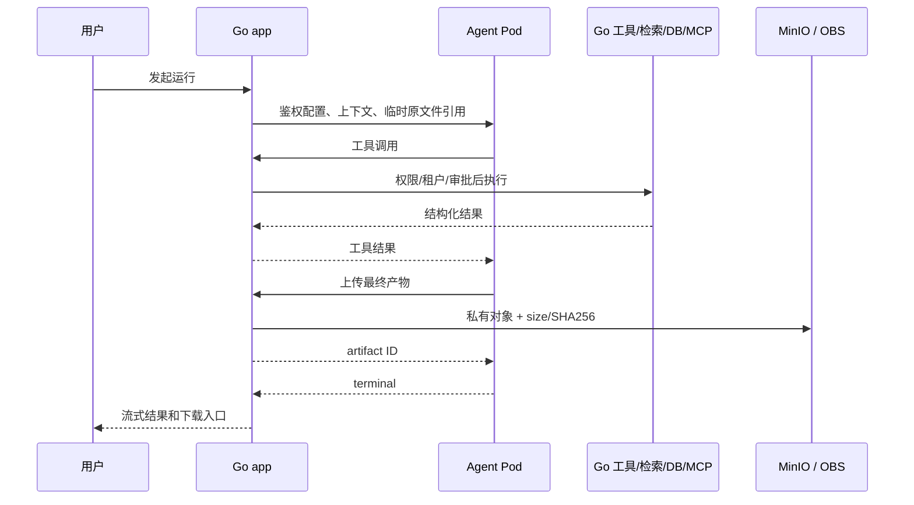

# WeKnora 智能体能力使用文档

> 当前实现交付版，更新日期：2026-08-12。
> 本文说明每类智能体的特点、资源组合、旁路运行时、产物对象存储和双副本验收。
> 配置细节见[智能体开发指南](./使用指南/智能体开发指南.md)。

用户界面当前品牌为“茅台智汇”；接口、嵌入 SDK 和技术配置仍使用 WeKnora 名称。

## 1. 智能体类型

| 类型 | 适用场景 | 关键能力 |
|---|---|---|
| 快速问答 | 制度、手册、产品资料 | RAG、引用、稳定回答 |
| 简单对话 | 写作、闲聊、临时文件 | 对话、图片/音频/附件 |
| 智能推理 | 多步骤业务问题 | ReAct、工具、MCP、Web |
| Wiki 问答 | 体系化知识阅读 | 页面、目录、链接关系 |
| 数据分析 | 经营/业务数据库 | 只读 SQL、指标、图表 |
| 表格分析 | CSV/Excel | schema、DuckDB、图表 |
| 通用智能体 | 综合流程 | 知识、DB、MCP、技能、Web、产物 |
| 文档处理 | 办公文档 | Word、Excel、PDF、PPT |

## 2. 两类运行链路

### 2.1 原生问答/推理

快速问答、简单对话、智能推理、Wiki 等使用 WeKnora 原生对话/Agent 流程，根据
配置注册知识、Wiki、图谱、Web、MCP 等能力。

### 2.2 Claude SDK 旁路

数据分析、表格分析、通用和文档处理使用 Agent 旁路运行时：



Python Agent 不直接连接：

- WeKnora PostgreSQL。
- 业务 MySQL/PostgreSQL。
- MCP 服务或 OAuth Token。
- MinIO/OBS 凭据。

这些边界都由 Go 管理。

## 3. 快速问答

适合制度、流程、手册和标准资料。

配置重点：

- 绑定明确知识库。
- 选择 Embedding/Rerank 和检索参数。
- 要求回答附来源。
- 设置无答案兜底。
- 先确保文档完整完成。

验收重点：

- 已知问题召回正确 chunk。
- 引用可打开。
- 无资料问题不编造。
- 多用户权限隔离。

## 4. 简单对话

适合：

- 写作与改写。
- 非知识库闲聊。
- 本轮图片、音频或附件理解。
- 临时 Web 搜索。

它不默认检索企业知识。需要知识依据时应绑定知识库或选择快速问答/通用智能体。

## 5. 智能推理

适合多个步骤、多个工具的任务。

配置重点：

- 只注册任务需要的工具。
- 明确知识、数据库、用户附件和 Web 的优先级。
- 高风险 MCP/外部动作启用审批。
- 设置最大迭代和失败兜底。

验收要覆盖工具失败、审批拒绝、超时和无权限，而不只是 happy path。

## 6. Wiki 问答

适合页面化知识、目录和概念关系。

- 使用 Wiki 页面和链接。
- 可与 RAG 混合。
- 页面链接图不同于 Neo4j 实体图。
- 大量节点通过分类、搜索、分页和中心节点一跳图浏览。

点击关联节点后，它会成为新的中心节点，继续加载自己的关联图。

## 7. 数据分析

数据源支持 MySQL/PostgreSQL。

### 7.1 Go 侧工具

- `db_catalog`
- `db_schema`
- `db_query`

### 7.2 安全限制

- 只读查询。
- 可见 schema/table/column。
- 最大返回行数。
- 最大扫描量。
- 查询超时。
- 敏感字段隐藏/脱敏。
- 共享智能体仍使用源租户授权范围。

### 7.3 验收

1. 列目录。
2. 看 schema。
3. 执行只读查询。
4. 核对指标口径和单位。
5. 需要时生成结构化图表。
6. 验证写 SQL 被拒绝。

## 8. 表格分析

输入：

- 知识库 CSV/Excel。
- 本轮上传 CSV/XLS/XLSX。

工具：

- `table_schema`
- `table_analysis`

运行时使用 DuckDB 做结构化分析，不绑定业务数据库。

验收必须分别覆盖：

- CSV。
- XLS。
- XLSX。
- 空值、日期、数字、单位和多工作表。
- 聚合、筛选和图表。

不能用一份简单 CSV 的成功代表全部表格格式。

## 9. 通用智能体

可组合：

- 知识库检索。
- Wiki/图谱。
- Web search/fetch。
- MCP。
- 轻量/专业技能。
- 数据库。
- 图片、音频和附件。
- 最终产物。

建议只启用真实需要的能力。工具越多不代表效果越好，会增加选择歧义、权限面和
失败组合。

常规通用智能体最多返回 5 个产物；合计必须小于 128 MiB。知识库管理类型的产物
数量策略不同，但总大小边界不变。

## 10. 文档处理智能体

独立镜像包含：

- LibreOffice。
- Pandoc。
- PDF 工具。
- Word/Excel/PDF/PPT Python 库。
- 中文字体。

### 10.1 Word

- 创建/修改报告、公文、制度和说明书。
- 沿用企业模板。
- 检查标题、页眉页脚、表格和样式。

### 10.2 Excel

- 生成表格、公式、样式和分析报告。
- 核对数据、公式和工作表结构。

### 10.3 PDF

- 生成、转换和渲染。
- 最终检查可读性、页数和字体。

### 10.4 PPT

- 创建演示结构、图文和模板。
- 检查页面溢出、中文字体和转换结果。

最终产物必须先提交对象存储，再发送 terminal；不能返回只存在于 Agent Pod 的
本地路径。

## 11. 知识库和检索

Agent 使用知识库前先确认：

- 文档不是只完成主解析，而是启用衍生全部完成。
- 向量和关键词可检索。
- Embedding 维度与索引一致。
- 图谱/Wiki 真实存在。
- 用户有当前知识库权限。

如果召回有问题，优先修复资料、分块、TopK、阈值、Rerank 或索引。不要通过修改
提示词假装已经召回正确资料。

## 12. MCP、Web 和技能

### MCP

- 使用当前 WeKnora 服务配置。
- 支持 selected/all/none。
- OAuth、Header、审批和审计由 Go 管理。
- Python 不能传任意工具名绕过本次注册清单。

### Web

- Agent 配置和本次请求都允许时才注册。
- URL 仍受 SSRF 和 provider 约束。

### 技能

- 轻量技能：提示词和规则。
- 专业技能：`SKILL.md`、脚本、模板和引用资料。
- Docker sandbox 在每个 app 节点使用同版本预载技能。

## 13. 图片、音频和原附件

原文件交付流程：

1. app 把原文件写入独立的 MinIO/OBS 临时前缀。
2. 键使用 tenant + 随机 transfer UUID，不含原文件名/用户名。
3. Agent 下载并校验 size/SHA256。
4. 本地临时目录使用文件。
5. 成功、失败、取消或 panic 后幂等删除。
6. 生产临时前缀另设最长 24 小时生命周期。

生产普通原附件上限为 50 MiB。

## 14. 最终产物

### 14.1 存储

- 开发：MinIO。
- 生产：私有 OBS。
- 路径：用途 + deployment + namespace UUID + tenant + session + run +
  artifact UUID。
- 不包含原文件名、用户名或业务敏感文本。

### 14.2 提交

1. Agent 在按 Pod 隔离的 hostPath scratch 目录生成。
2. 通过内部 artifact upload API 上传 API 服务。
3. API 服务校验专用内部 API Key。
4. API 服务预留唯一对象键并流式写入。
5. 校验大小和 SHA256。
6. 幂等写入 artifact 行。
7. 返回 artifact ID。
8. Agent 发送 terminal。

### 14.3 下载和删除

- 任意 app 都可以处理。
- 先校验 tenant/session/run/artifact 权限。
- 对象默认 private。
- 删除会同步清理数据库和对象。
- 跨租户请求必须拒绝。

内部代理至少允许 128 MiB，避免 Base64/JSON 或产物上传在到达 app 前 413。

## 15. 多副本

生产：

```text
general-agent                    2 副本
document-processing-agent        2 副本
```

一次 SDK 运行固定在一个 Pod：

- 中间目录不跨 Pod。
- 不使用 RWX。
- 不把 OBS/S3 挂成 POSIX 工作区。
- 产物提交前 Pod 退出：本轮失败/重试。
- 产物提交后 Pod 退出：持久产物不受影响。
- 新请求由另一个 ready Pod 接收。
- 恢复后重新加入 Service 分流。

## 16. 每类智能体的测试

| 类型 | 必须验证 |
|---|---|
| 快速问答 | 召回、引用、无答案 |
| 简单对话 | 文本、图片、音频、附件 |
| 智能推理 | 多步工具、审批、失败恢复 |
| Wiki | 页面、目录、关联跳转 |
| 数据分析 | 只读 SQL、范围、口径、图表 |
| 表格分析 | CSV、XLS/XLSX、聚合 |
| 通用 | 知识、Web、MCP、技能、DB、产物组合 |
| 文档处理 | Word、Excel、PDF、PPT、模板和中文渲染 |

所有旁路类型还要验证：

- 两个副本都被真实请求命中。
- 停一个 Pod 后新运行可用。
- 恢复后重新分流。
- 产物数据库 URI 指向 MinIO/OBS。
- 大小/SHA256 一致。
- 任意 app 下载/删除正常。

## 17. 安全边界

- Go 掌握权限、租户、工具、数据库、MCP、对象和审计。
- Agent 内部 Key 不复用 JWT、模型 Key 或 OBS AK/SK。
- Secret 不写 Git、日志、工单和文档。
- 高风险工具启用审批。
- 数据库保持只读。
- 对象保持 private。
- 分享页使用独立代理校验源会话和产物。

## 18. 生产资源

| 服务 | request | limit | 临时卷 |
|---|---:|---:|---:|
| general-agent | 250m/768Mi | 1500m/2Gi | 隔离 hostPath scratch |
| document-processing-agent | 500m/1280Mi | 2500m/4Gi | 隔离 hostPath scratch |

两个服务部署在 `10.14.201.1/.2` 并按主机名打散。滚动更新
`maxSurge=0,maxUnavailable=1`。

## 19. 发布清单

- [ ] Agent 类型和业务场景匹配。
- [ ] 模型、知识库、数据源、MCP、技能和文件类型可用。
- [ ] 知识库文档完整完成。
- [ ] 权限和共享范围正确。
- [ ] 每类智能体按自身特点测试。
- [ ] 两个 Agent 服务的两个副本真实命中。
- [ ] 单 Pod 故障和恢复通过。
- [ ] 产物在 terminal 前进入私有对象存储。
- [ ] 任意 app 可下载/删除，跨租户拒绝。
- [ ] 召回问题没有通过修改提示词掩盖。
- [ ] 已知基础设施单点记录在生产交接。

## 20. 进一步阅读

- [智能体开发指南](./使用指南/智能体开发指南.md)
- [Claude SDK 通用运行时实现说明](./通用智能体方案.md)
- [系统介绍说明](./系统介绍说明.md)
- [系统使用说明](./系统使用说明.md)
- [当前版本生产更新部署执行手册](./当前版本生产更新部署执行手册.md)
- [当前生产实现与部署基线](./当前生产实现与部署基线.md)
