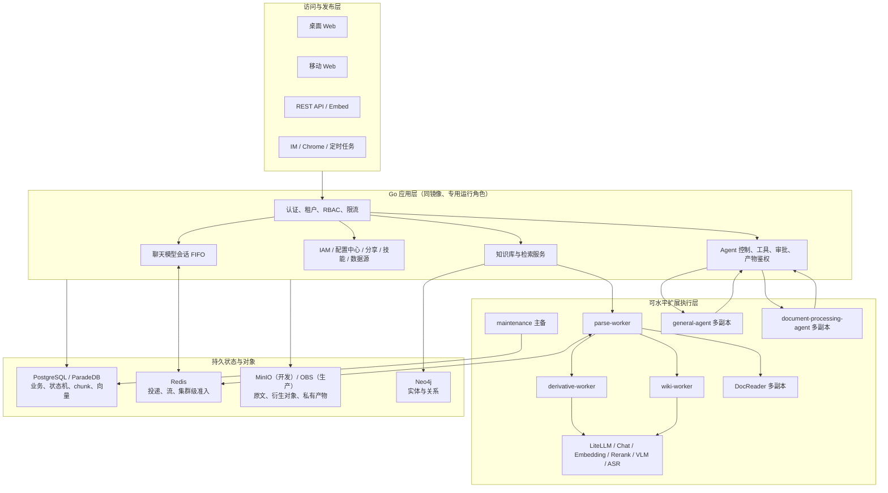
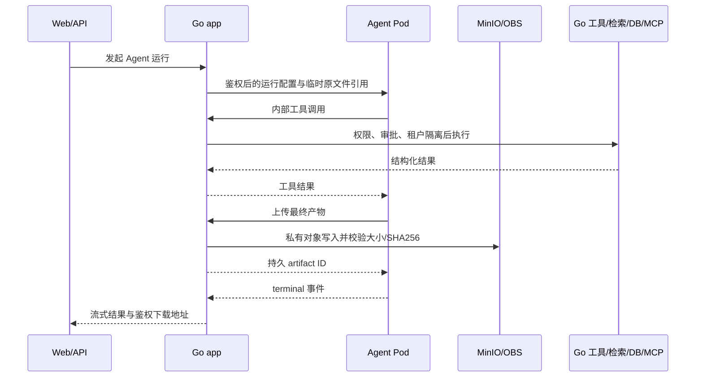

# 当前实现架构与文档索引

> 适用代码基线：当前工作区，核对日期 2026-07-31。
> 本文描述已经落地并经过测试的实现，不是未来路线图。生产更新必须同时阅读
> [当前版本生产更新部署执行手册](./当前版本生产更新部署执行手册.md)。

## 1. 文档的权威关系

本项目已经显著偏离上游 WeKnora，不能只依据上游 README、默认 Helm 值或生产旧
清单判断当前行为。文档按以下优先级使用：

1. 本文：当前代码的总体架构、组件边界、关键语义和文档入口。
2. [当前版本生产更新部署执行手册](./当前版本生产更新部署执行手册.md)：
   针对现有生产 CCE 的逐步迁移、部署、验收和回滚命令。
3. [生产集群无 RWX 最优部署方案](./生产集群无RWX最优部署方案.md)：
   目标拓扑、资源与容量依据、存储设计和单点边界。
4. [文档解析水平扩展与故障恢复](./文档解析水平扩展与故障恢复.md)：
   文档级持久队列、状态机、租约、fencing、接管和专项测试。
5. [`helm/values-production-ha.yaml`](../../helm/values-production-ha.yaml)：
   与上述生产方案对应的机器可渲染配置基线。
6. [容量与调度统一控制](./容量与调度统一控制.md)：
   实际模型资源池、有效值编译、跨模块匹配、等待/失败语义和 API 验收。
7. [聊天模型会话队列与生产配置](./聊天模型会话队列与生产配置.md)：
   会话级模型队列、配置层级、用户状态、本地并发结果和生产配置。
7. 功能/API/测试文档：描述具体入口、字段、操作和验收。

如果文档与代码冲突，以当前代码和自动化测试为准，并应在同一变更中修正文档；
不能通过沿用旧文档来降低当前功能。

## 2. 平台边界

当前项目是基于 WeKnora 深度二开的企业知识与智能体平台，主要包含：

- 文档、FAQ、Wiki、向量、关键词和知识图谱等知识形态。
- 文档解析、分块、向量化、多模态、ASR、摘要、问题生成、图谱和 Wiki 的完整工作流。
- 快速问答、简单对话、智能推理、Wiki、数据分析、表格分析、通用智能体和文档处理智能体。
- 多租户、RBAC、共享空间、统一身份、默认配置、审计和凭据保护。
- Web、移动 Web、REST API、嵌入、IM、浏览器扩展和定时任务。
- PostgreSQL、Redis、对象存储、DocReader、Neo4j、模型网关和 Agent 旁路服务。

## 3. 总体逻辑架构



核心约束：

- Go app 是业务权限、租户、状态、工具执行和持久化的唯一控制边界。
- 同一 Go 镜像通过 `WEKNORA_RUNTIME_ROLE` 拆为 API、解析、衍生、Wiki 和维护角色；
  生产禁止 `dev-all`，公网 Service 只选择 API Pod。
- Redis 用于投递和共享准入，但 PostgreSQL 才是文档工作流的持久事实来源。
- 实际模型资源池是模型调用、聊天执行会话和后台文档 fan-out 的唯一并发真源；
  聊天等待室和单用户公平性仍由聊天队列独立管理。
- Python Agent 不直接连接 WeKnora 数据库、业务数据库、MCP 或对象存储凭据。
- 生产长期文件使用私有 OBS；跨 Pod 共享不依赖 RWX。

## 4. 文档处理数据流


### 4.1 排队单位

外层队列单位是“文档工作流”，不是 `parse`、`embedding`、`wiki`、`graph` 等任务
类型。假设系统同时收到 500 份文档：

- 3 个 parse-worker、每实例完整文档并发为 4 时，最多同时接纳 12 份完整文档。
- 每个已接纳文档在同一个工作流所有权下推进主解析和启用的衍生阶段。
- 空闲实例从全局等待文档中继续领取，慢实例上的可安全接管文档可回到全局队列。
- 不会先把 500 份文档都做完主解析，再让全部 Wiki/图谱长期堆在队尾。

问题生成等外部模型型子任务可以使用隔离的内部资源通道，但这不改变文档工作流
的排队、所有权和完成语义。

### 4.2 完成判定

文档卡片显示“已完成”必须同时满足：

| 阶段 | 启用时的成功条件 |
|---|---|
| 主解析 | `parse_status=completed`，没有仍在运行的解析子任务 |
| 分块和索引 | chunk 已持久化；启用的向量/关键词索引已写入 |
| 多模态 | 配置了 VLM/ASR 且内容适用时，相关子任务达到成功终态 |
| 摘要 | `summary_status=completed` |
| 问题生成和图谱抽取 | `enrichment_status=completed`，对应批任务均已收敛 |
| Wiki | `wiki_status=completed`，页面、引用和队列均已收敛 |
| 工作流 | 没有 `pending/running/finalizing` 子项，终态写入通过 generation/epoch 校验 |

不能只相信一个测试脚本的 `completed` 字符串。最终验收还要直接检查：

- PostgreSQL 中工作流、chunk、向量、问题、Wiki 和状态列。
- Neo4j 中预期的节点和关系。
- MinIO/OBS 中原文和衍生对象。
- 真实召回及来源引用。

### 4.3 `none`、跳过与失败

- `none` 是持久字段的历史初始值。文档仍在等待或前置解析未完成时，前端显示
  “尚未开始/等待前置解析”，不能显示“已跳过”。
- `skipped` 只表示功能关闭、内容明确不适用，或具有结构化原因的有意跳过。
- 配置启用但执行异常、批次部分失败或结果不完整时，必须是 `failed` 或
  `degraded`，不能伪装成跳过或成功。
- 总状态筛选使用完整工作流投影，不只使用 `parse_status`，因此衍生阶段失败的
  文档可以被“失败”准确筛出。

### 4.4 大文件与复杂格式

- 对外知识源原文件上限为 2048 MiB。
- 普通附件和单次解析传输上限为 50 MiB；更大的知识文件先拆分再送 DocReader。
- 入口必须允许 2304 MiB 知识源请求并关闭请求缓冲，内部 Agent JSON/Base64
  代理至少允许 128 MiB。
- Word、Excel、PPT、PDF、文本、网页、图片和音频根据配置走相应解析器、VLM
  或 ASR；超大文件受拆分窗口、膨胀比和任务预算保护。
- 预览先读取 preview policy，超大或高风险文件不一次性加载到浏览器。

## 5. 持久队列与故障恢复

### 5.1 事实来源和投递语义

- PostgreSQL 保存工作流、文档 generation、所有者、boot ID、execution epoch、
  租约和进度。
- Redis/Asynq 采用 at-least-once 投递；业务提交使用 generation、epoch、稳定任务
  ID 和幂等键收敛到有效一次结果。
- Redis 或 app 重启不会使 PostgreSQL 中已经接收的文档消失。

### 5.2 实例身份与接管

每个 parse-worker 具有稳定 `instance_id`，每次进程启动生成新的 `boot_id`：

- 同一实例重启后可以识别旧 boot，并恢复自己上次领取的工作流。
- 健康实例通过心跳和租约续持所有权。
- 心跳超时只是“可疑”，不能单独证明进程已经停止。
- 跨实例接管还必须通过租约、boot/epoch fencing，以及可用时对 Kubernetes
  容器终止或节点已被隔离的精确证明。
- 旧执行即使迟到返回，也不能越过新的 epoch 写入当前 generation。

优雅退出时 app 先停止接收新文档，在限定时间内排空；硬故障由恢复器在安全边界
满足后重新分发。详情见[文档解析水平扩展与故障恢复](./文档解析水平扩展与故障恢复.md)。

### 5.3 删除与重建

- 解析中删除会先取消/隔离当前 generation，清除未完成任务，再删除 chunk、
  索引、问题、图谱、Wiki 引用和对象。
- 已完成删除使用同一清理边界，不能只删除知识表一行。
- 重建生成新 generation；旧 generation 的迟到任务被 fencing。
- 删除或重建后，前端筛选、队列位置和状态轮询必须立即进入新状态桶。

### 5.4 长耗时模型任务

- VLM 图片使用独立 worker lane；真实调用失败最多尝试 10 次，断路器预拒绝和 Pod
  关闭不消耗业务次数。
- OpenAI 兼容 VLM 使用流式进度保护：首 token/流中断超时及缺少终止状态的异常 EOF
  计入供应商健康，持续生成超总预算、重复失控或命中输出上限不误触发共享熔断；
  OCR 命中输出上限时保留有效前缀并标记 `degraded`，其他 OCR 失败后不在同一尝试中
  继续发 Caption。
- Wiki 默认每批内只调用一次模型，失败交回 PostgreSQL 持久队列；按失败次数和
  最近尝试时间轮转，单个 900 秒毒任务不能长期占住 FIFO 头部。
- 达到上限后写入业务失败结果/死信并让其余队列继续，不把失败伪装成成功或跳过。
- 更新、对账和恢复步骤见
  [长耗时模型任务有界重试与无丢失部署](./长耗时模型任务有界重试与无丢失部署.md)。

## 6. 模型和解析准入

模型准入是 Redis 共享的“集群总量”，不是每个 API/worker Pod 各自拥有一套：

| 资源 | 集群并发 | 单租户并发 | 说明 |
|---|---:|---:|---|
| Chat | 24 | 12 | 另保留 2 个交互槽位 |
| Embedding | 32 | 16 | 向量批处理共享 |
| Rerank | 24 | 12 | 检索与批处理共享 |
| VLM | 4 | 2 | 图片/页面理解 |
| ASR | 2 | 1 | 音频识别 |
| Parser | 12 | 4 | DocReader/解析准入 |

DeepSeek V4 Flash 的受控测试在 32 并发、每次实际生成 160 token 时 32/32 成功，
P95 为 5.655 秒。生产 Chat 取 24，保留约 25% 的并发余量，避免长上下文、长输出
和提供商抖动耗尽全部槽位。原始结果：
[`custom/tests/model_capacity_reports/20260726-deepseek-v4-flash.json`](../../custom/tests/model_capacity_reports/20260726-deepseek-v4-flash.json)。

管理员设置中的 `asynq.concurrency` 是“每个 parse-worker 的完整文档工作流并发”。
生产值为 4，三个 parse-worker 的集群完整文档容量为 12。内部子任务线程和模型
集群准入是不同层次，不能通过把三者设置为同一个大数字来扩容。

聊天另有会话级 FIFO：默认每个实际模型资源池执行 8、等待 500，单用户在所有
模型池合计等待 3；生产建议把全局等待覆盖为 200，再对有容量报告的模型单独设置。
已接受 waiter 通过 SSE 自动晋升；个人满和池满分别返回不同结构化 429，并在消息
创建前拒绝。完整边界见
[聊天模型会话队列与生产配置](./聊天模型会话队列与生产配置.md)。

## 7. 存储架构

| 数据 | 开发环境 | 生产环境 | 持久性 |
|---|---|---|---|
| 原始知识文档 | MinIO | 私有 OBS | 持久 |
| 解析衍生图片/对象 | MinIO | 私有 OBS | 持久 |
| Agent 最终产物 | MinIO | 私有 OBS | 持久、鉴权下载 |
| Agent 原文件中转 | MinIO 临时前缀 | OBS 临时前缀 | 成功/失败/取消后删除，生命周期 ≤24h |
| app/DocReader 解析工作区 | Pod/节点本地临时盘 | `csi-local-topology` RWO 临时卷 | 可丢弃 |
| Agent SDK/Office 工作区 | Pod/节点本地临时盘 | `csi-local-topology` RWO 临时卷 | 可丢弃 |
| 状态、chunk、向量、问题、Wiki | PostgreSQL | PostgreSQL/ParadeDB | 持久 |
| 实体和关系 | Neo4j | Neo4j | 持久 |
| 投递、流、准入租约 | Redis | 外部 Redis | 可恢复的运行状态 |

生产不使用 RWX。对象存储也不能挂载成解析或 Office 的 POSIX 工作目录；大量小
文件、随机写、rename 和目录遍历必须在本地临时盘完成。

三个对象用途使用互不重叠的、部署级和 namespace UUID 级唯一前缀：

```text
weknora/__weknora_private_knowledge_objects_v1__/deployment/<deployment>/namespace/<uuid>/
weknora/__weknora_private_agent_artifacts_v1__/deployment/<deployment>/namespace/<uuid>/
weknora/__weknora_claude_sdk_original_inputs_v1__/deployment/<deployment>/namespace/<uuid>/
```

前缀不能在测试、容灾演练或另一套集群重复使用。对象默认私有，下载必须先在 app
校验 tenant/session/artifact 权限，不能对企业文档使用 `public-read`。

## 8. Agent 运行架构



`general-agent` 和 `document-processing-agent` 都可部署两副本。一次正在进行的
SDK 运行固定在一个 Agent Pod 内，本地目录仅在该 Pod 使用；最终产物必须在
terminal 事件前进入对象存储，因此后续请求落到任意 app 都可以下载。Pod 在产物
提交前崩溃时，本次运行失败/重试，不把半成品目录当作持久状态。

所有使用这两个旁路服务的智能体都遵守同一边界，但保留自身特点：

- 通用智能体：知识检索、Web、MCP、技能、数据库和多步骤工具组合。
- 数据分析：受限只读 SQL、元数据语义、行数/扫描/超时边界和图表。
- 表格分析：CSV/Excel、对话附件、结构化分析和导出。
- 文档处理：Word/Excel/PDF/PPT 生成、修改、转换及模板。

## 9. 前端大数据量交互

### 9.1 文档列表和状态

- 卡片显示简洁总状态和当前文档的全局排队位置。
- 页面同时显示系统等待总量，不泄露其他租户的文档详情。
- 悬停详情展示解析、索引、多模态、摘要、问题/图谱、Wiki 的分项状态。
- “全部/等待/处理中/取消中/删除中/已完成/失败/已取消/草稿”按完整工作流准确筛选。

### 9.2 文件夹和搜索

知识库目录树与文档列表采用服务端分页、游标/页码和渐进加载；搜索不会把整库
节点先载入浏览器。支持文件夹创建、重命名、删除、移动文档，以及文件、URL 和
手工 Markdown 入库。

### 9.3 大文档预览

前端先请求 `/api/v1/knowledge/:id/preview-policy`。只有后端确认可安全内联时才
加载预览；大文件使用服务端范围、分页或下载，不把完整内容/完整 PDF 页面一次性
塞入 DOM。

### 9.4 Wiki 图

Wiki 页面按类型分类、搜索和分页。图默认只取有界概览；选择节点后请求该节点的
一跳 ego 图。点击任一关联节点会把它设为新的中心并加载其邻接图，而不是在旧图
无限追加整库节点。邻居过多时继续分页/展开。

## 10. 生产目标拓扑

当前生产环境的落地拓扑不是分阶段草案：

| 节点 | 规格 | 工作负载 |
|---|---|---|
| `10.14.201.1` | 8C/32Gi，500G 数据盘 | API、parse-worker、部分衍生/Wiki/维护、DocReader、Agent、Web |
| `10.14.201.2` | 8C/32Gi，500G 数据盘 | 与 `.1` 对称打散 |
| `10.14.201.7` | 8C/32Gi，迁移后数据盘 | API、parse-worker、DocReader，并承接第三工作节点负载 |
| `10.14.201.6` | 8C/16Gi | 现有 PostgreSQL、LiteLLM、Ingress 等 |
| `10.14.201.54` | 8C/16Gi | 现有 Neo4j、Ingress 等 |

目标副本和关键资源：

| 组件 | 副本 | 每副本并发/worker | request | limit | 临时卷 |
|---|---:|---:|---:|---:|---:|
| API | 3 | SSE/API | 1C / 2Gi | 2C / 4Gi | 仅临时附件 |
| parse-worker | 3 | 完整文档 4 | 1.5C / 3Gi | 4C / 6Gi | 80Gi |
| derivative-worker | 2 | 后台 task 16 | 0.75C / 1.5Gi | 2C / 3Gi | 小型临时卷 |
| wiki-worker | 2 | Wiki Map 4 | 0.75C / 1.5Gi | 2C / 3Gi | 小型临时卷 |
| maintenance | 2 | PG advisory 主备 | 0.25C / 512Mi | 1C / 1Gi | 无 |
| DocReader | 3 | gRPC worker 4，PDF render 4 | 1.5C / 3Gi | 6C / 10Gi | 100Gi |
| general-agent | 2 | 单次运行固定一 Pod | 0.5C / 1Gi | 2C / 2Gi | 20Gi |
| document-processing-agent | 2 | 单次运行固定一 Pod | 1C / 1.5Gi | 3C / 4Gi | 40Gi |
| frontend | 2 | 无状态 | 0.1C / 128Mi | 0.5C / 512Mi | 无 |
| mobile-web | 2 | 无状态 | 0.05C / 64Mi | 0.3C / 512Mi | 无 |

API、parse-worker 和 DocReader 使用 `.1/.2/.7` 主机名拓扑打散，其他双副本角色
跨不同工作节点，Agent/Web 使用 `.1/.2` 打散。大临时卷工作负载滚动更新必须
`maxSurge=0, maxUnavailable=1`，避免临时出现第四个 100Gi 解析卷导致本地卷池不足。

完整生产命令、节点标签、SWR 镜像、Secret、迁移和回滚见
[当前版本生产更新部署执行手册](./当前版本生产更新部署执行手册.md)。不能仅复制
本节表格后直接上线。

## 11. 可用性边界

已经消除的单 Pod 故障：

- API、各 worker、DocReader、两个 Agent、桌面前端和移动前端均有多副本。
- 文档工作流可在安全证明旧执行终止后由其他 parse-worker 接管。
- 已完成文档和 Agent 产物位于对象存储，不依赖原 Pod 本地目录。

仍然存在的基础设施单点：

| 组件 | 当前形态 | 影响 |
|---|---|---|
| PostgreSQL | 单实例/单节点 RWO | 业务状态、工作流、chunk、向量全部停止 |
| Neo4j | 单实例 | 图谱写入和图查询停止 |
| Redis | 主从但无自动切换 | 投递、流和模型准入在主故障期间停止 |
| LiteLLM | 单实例 | 通过该网关的模型调用停止 |
| 故障域 | 单 AZ | 不能抵御整个可用区故障 |

因此当前实现可以水平扩展 API/文档处理并抵御执行层单 Pod/单节点故障，但不能宣称
“整套系统无单点”。生产部署必须保持这个边界，不得用多 app 的副本数掩盖状态层
单点。

## 12. 代码目录

| 目录 | 作用 |
|---|---|
| `internal/custom/bootstrap/` | 二开后端统一创建、迁移、路由、调度和 Hook 注册 |
| `internal/custom/modules/documentqueue/` | 文档级持久队列、实例、租约、fencing、接管 |
| `internal/custom/modules/modeladmission/` | 按实际路由/模型/租户的 Redis 集群级调用准入和资源池控制面 |
| `internal/custom/modules/chatqueue/` | 聊天会话 FIFO、个人等待上限、跨 API 租约和热策略 |
| `internal/custom/modules/workretry/` | VLM/Wiki 长耗时模型任务的有限次数和真实调用计数 |
| `internal/custom/modules/documentsplit/` | 超大文档拆分、投递/执行 epoch、重启恢复、业务失败预算和代表性采样 |
| `internal/custom/modules/dependencycontrol/` | PostgreSQL/ParadeDB 共享能力断路、健康校验、自动修复和角色 readiness |
| `internal/custom/modules/artifactstore/` | 私有 Agent 产物对象存储和迁移 |
| `internal/custom/modules/knowledgefolders/` | 文件夹、渐进列表、搜索和移动 |
| `internal/custom/modules/documentpreview/` | 大文件预览策略 |
| `internal/custom/modules/knowledgeworkflowfilter/` | 完整工作流状态筛选 |
| `internal/custom/modules/knowledgepurge/` | 文档删除的关系库/对象/图谱/Wiki 清理 |
| `internal/custom/modules/generalagent/` | Agent 控制、工具桥、产物和下载鉴权 |
| `frontend/src/custom/modules/documentQueue/` | 队列总量和文档位置 |
| `frontend/src/custom/modules/chatqueue/` | 聊天等待卡、个人/系统拒绝提示和取消 |
| `frontend/src/custom/modules/knowledgeWorkflowStatus/` | 完整状态、分项状态和筛选 |
| `frontend/src/custom/modules/knowledgeFolders/` | 文件夹和渐进加载 |
| `frontend/src/custom/modules/documentPreview/` | 预览安全策略 |
| `frontend/src/custom/modules/wikiGraph/` | Wiki 图交互辅助逻辑 |
| `custom/services/` | Agent、拆分器和模型旁路服务 |
| `custom/tests/` | 二开 API/E2E/故障/容量/迁移验收 |
| `deploy/production/` | 生产站点值、迁移 Job 和辅助脚本 |
| `helm/` | 通用 Chart 与当前生产覆盖 |

完整二开边界见[二开目录结构规范](./二开目录结构规范.md)。

## 13. 已验证基线

### 13.1 真实数据完成性

保留的“公司制度”知识库 `efee9ac7-b68b-413e-b09e-77501032a194`：

- 632/632 文档主解析、摘要、问题/图谱、Wiki 均为完成，未完成子任务为 0。
- 7,871 个 chunk、13,267 个启用向量、5,396 个生成问题。
- 1,660 个已发布 Wiki 页面，引用覆盖 632 份文档。
- Neo4j 20,008 个节点、13,765 条关系。
- 632 个持久工作流均完成，没有非终态记录。

另有“数据资料”11/11 和“全格式”27/27 完成。验收不应删除
或重新解析“公司制度”知识库。

### 13.2 多实例和性能

- 500 份文档负载：500/500 完成，约 4.10 docs/s。
- 同一严格匹配的 100 文档负载：单 app 约 1.23 docs/s，三 app 约
  4.50 docs/s，本地测试提升 3.67 倍；该数值是测试证据，不是生产 SLA。
- 双副本桌面/移动入口正常分流；各停一个副本时请求全部成功，恢复后重新加入。
- general-agent、document-processing-agent 及依赖它们的各类智能体已执行双副本、
  并发、产物和故障验证。
- 最终报告：
  [`final_acceptance_report.json`](../../custom/tests/document_processing_cluster_e2e/final_acceptance_outputs/20260726-0107/final_acceptance_report.json)。

### 13.3 已知非阻断项

- Vite 构建仍提示部分 chunk 大于 500 KiB。
- 验收环境 LiteLLM 请求 `/v1/responses/input_tokens` 时收到 405，随后使用本地
  tokenizer 兼容回退；会增加少量日志和计数开销，但未观察到对话/召回失败。
- 上游 LiteLLM 偶发 `aiohttp` client session 未关闭警告；当前未观察到请求失败、
  Pod 重启、OOM 或队列阻塞，生产应继续监控文件描述符和内存。
- 文档处理轨迹已收敛到 `custom_processing_spans_v2` 唯一权威表；容量等待不落业务
  span，重投按稳定逻辑键更新同一行。旧物理投递轨迹表已从开发基线移除。
- Windows 宿主无法构建 `pg_query` 的 Parse/Deparse；实际 Linux 目标包测试通过。

这些问题不能被描述成当前文档解析完成性失败，但后续维护应继续跟踪。

## 14. 文档入口

### 使用与功能

- [用户使用指南](./使用指南/用户使用指南.md)
- [智能体开发指南](./使用指南/智能体开发指南.md)
- [Wiki 与大规模图展示](../KnowledgeGraph.md)
- [常见问题](../QA.md)
- [API 文档](../api/README.md)

### 架构与开发

- [二开目录结构规范](./二开目录结构规范.md)
- [文档解析水平扩展与故障恢复](./文档解析水平扩展与故障恢复.md)
- [Claude SDK 通用运行时实现说明](./通用智能体方案.md)
- [知识库管理智能体](./知识库管理智能体.md)
- [统一身份认证与默认配置](./统一身份认证与默认配置实现说明.md)

### 部署与运维

- [当前版本生产更新部署执行手册](./当前版本生产更新部署执行手册.md)
- [长耗时模型任务有界重试与无丢失部署](./长耗时模型任务有界重试与无丢失部署.md)
- [生产集群无 RWX 最优部署方案](./生产集群无RWX最优部署方案.md)
- [Helm Chart](../../helm/README.md)
- [生产部署文件入口](../../deploy/production/README.md)
- [多实例文档处理验收](../../custom/tests/document_processing_cluster_e2e/README.md)

### 综合交付说明

- [系统介绍说明](./系统介绍说明.md)
- [系统使用说明](./系统使用说明.md)
- [WeKnora 智能体能力使用文档](./WeKnora智能体能力使用文档.md)

## 15. 文档维护范围

“更新所有文档”按以下边界执行：

- 项目说明、架构、部署、API、用户指南、组件 README、二开模块 README、测试
  README 和综合交付说明必须与当前实现同步。
- `testdata/`、`fixtures/`、测试上传样本中的 Markdown/TXT 是测试输入，不能为了
  更新说明而改写。
- `skills/*/SKILL.md` 和文档模板是运行时指令/模板，应按对应能力单独验证，不能
  批量替换成架构说明。
- CHANGELOG 的历史版本记录保持不可变，只在顶部增加当前未发布变更。
- 第三方/上游子项目 README 保留其自身范围；需要了解当前集成方式时，由本索引
  和根 README 提供覆盖说明。
