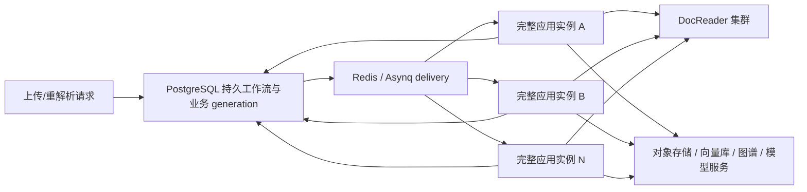
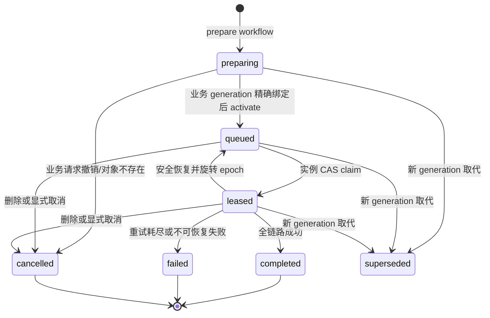

# 文档解析水平扩展与故障恢复

本文说明 WeKnora 二开文档工作流队列的运行语义、部署方式、故障恢复边界和验收方法。实现主体位于 `internal/custom/modules/documentqueue/`，前端队列展示位于 `frontend/src/custom/modules/documentQueue/`，符合[二开目录结构规范](./二开目录结构规范.md)。

本文所说的“文档处理”包含主解析、分块、向量化、多模态处理，以及按知识库配置开启的摘要、问题生成、知识图谱和 Wiki 等衍生阶段。它不等同于某一个 Asynq 子任务。

## 目标与非目标

该能力解决以下问题：

- 每个应用实例都具备完整文档处理能力，通过增加同构实例水平扩展总吞吐。
- 管理员配置的 `asynq.concurrency` 表示单个实例同时接纳的完整文档工作流数，而不是整个集群的总并发，也不是内部子任务线程数。
- 所有实例共享一个按文档排队的持久工作流队列，空闲实例可以领取全局等待文档。
- 应用或 Redis 重启后，已经接受的文档不会仅因进程内存或 Redis delivery 丢失而消失。
- 同一稳定实例重启可以续跑；跨实例转移只有在旧执行边界被精确证明已经终止后才允许发生。
- 通过 workflow、processing generation、boot ID 和 execution epoch 对迟到任务及旧实例写入进行 fencing。

该能力不直接提供以下保证：

- 不保证 Redis/Asynq 消息只投递一次。系统采用 at-least-once delivery，并在业务层保证同一文档 generation 收敛到唯一工作流和受 fencing 的有效提交。
- 不保证外部 LLM、DocReader 或第三方 API 调用只发生一次。进程在提交结果前异常时，重试可能再次调用外部服务；持久业务写入必须依靠 generation、epoch 和幂等键收敛。
- 增加应用实例不会自动让 PostgreSQL、Redis、对象存储、向量库、Neo4j、模型网关、Ingress 或负载均衡器变成高可用。
- 对无法证明旧执行已经终止的 pause、网络分区或节点失联，系统优先避免双执行，允许工作流暂时停滞。

## 总体架构



PostgreSQL 是文档工作流的 durable source of truth。Redis/Asynq 只负责把待执行工作送到可用实例；即使 Redis delivery 暂时不存在，恢复循环也能依据 PostgreSQL 中已接受的工作流重新补投。

每个应用副本同时运行三类执行器：

- 文档工作流执行器：只消费 document lane，并以 `asynq.concurrency` 为单实例完整文档 admission 上限。
- 后台子任务执行器：处理摘要、问题、图谱、多模态等内部 lane，其并发由 `WEKNORA_ASYNQ_TASK_CONCURRENCY` 等内部配置控制。
- Wiki Map 执行器：只处理文档局部、可持久检查点化的 Wiki 提取，消费独立 `wiki_map` lane；默认每实例并发 4，可通过 `WEKNORA_WIKI_MAP_TASK_CONCURRENCY` 调整。知识库共享页面的合并、索引和发布仍在 KB 级串行提交边界内完成。

所有应用副本都注册全部处理器，不需要按 Wiki、图谱或向量化拆成不同类型的专用 Pod。独立 lane 只是同一完整实例内的资源隔离，不是不同类型的服务。一个文档的衍生 delivery 可能由任一同构副本消费，但它们都受同一个 workflow、processing generation 和写入 fencing 约束；文档 owner 持有的 admission 槽位会等到该完整工作流达到终态才释放。

因此，在实例和下游资源都健康时，集群的理论文档 admission 容量约为：

```text
健康实例数 × 单实例 asynq.concurrency
```

这只是 admission 容量，不是模型、图数据库、向量库或 DocReader 的安全吞吐承诺。扩容应用副本也会放大后台子任务并发，应同时核对所有下游配额和连接池。

## 持久状态机

一条工作流以 `(tenant_id, knowledge_id, processing_generation)` 唯一。文档业务行通过 `processing_workflow_id` 绑定到为该 generation 准备的工作流，重复 producer、迟到 delivery 和恢复扫描会收敛到同一条持久记录。



各状态含义如下：

| 状态 | 含义 | 队列可见性 |
|---|---|---|
| `preparing` | workflow 已预建，但业务事务尚未精确绑定或激活 | 不计入等待、不允许 claim |
| `queued` | PostgreSQL 已接受，等待 Redis delivery 或实例领取 | 计入全局等待和位置排名 |
| `leased` | 已由一个精确的 instance ID、boot ID 和 execution epoch 持有 | 计入 active，不占等待位置 |
| `completed` | 完整工作流成功结束 | 不再排队 |
| `failed` | 工作流达到失败终态 | 不再排队，可由业务重解析创建新 generation |
| `cancelled` | 删除、对象不存在或显式取消 | 不再排队 |
| `superseded` | 文档已经进入更新的 processing generation，旧工作流失效 | 不再排队，旧 generation 的迟到任务被拒绝 |

`stage` 用于展示当前阶段，不替代上述 durable state。文档自身的 `parse_status` 和衍生任务状态也不是租约真相；恢复和 owner 判断必须以持久 workflow 为准。

多副本启动时不会由每个 Pod 并发执行生产 DDL。生产表结构应先通过 migration 安装，应用启动只验证必要表存在，以避免水平冷启动竞争 PostgreSQL catalog lock。

## 实例身份、boot ID 与 epoch fencing

每个运行实例包含三层身份：

- `instance_id`：由运行时保证唯一的稳定身份。
- `boot_id`：每次进程启动生成的新 UUID，代表一次具体进程 incarnation。
- `execution_epoch`：工作流每次被采用、接管或重新分发时递增的执行世代。

工作流租约同时记录 owner instance、owner boot、epoch 和 lease deadline。续租、完成和关键业务写入都必须匹配当前 owner 与 epoch；旧 boot 或旧 epoch 的迟到 delivery 只能被拒绝或 ACK，不能覆盖新 owner 的结果。

### 稳定实例身份要求

只有运行时能保证同一个 `instance_id` 不会同时对应两个活进程时，才允许启用：

```text
CUSTOM_DOCUMENT_QUEUE_TRUST_STABLE_INSTANCE_RESTART=true
```

内置部署采用以下身份：

- Docker Compose：使用唯一容器名对应的固定 instance ID。Docker 不会同时运行同名容器的两个 incarnation。
- Helm/Kubernetes：使用 `k8s/<namespace>/<pod UID>`。Pod UID 在容器原地重启期间不变，replacement Pod 一定获得新 UID。

自定义部署若只使用可重复 hostname、Deployment 名称或手工填写的共享 ID，必须保持该开关为 `false`，否则两个活进程可能互相采用租约。

## 重启续跑与跨实例转移

### 同一稳定实例重启

同一个稳定 instance ID 的新 boot 启动时，会在一个持久事务中采用该 instance 旧 boot 的未完成租约并递增 epoch。旧 boot 随后无法续租或提交。

这一能力适用于：

- Docker 同名容器重启。
- Kubernetes 同一个 Pod 内的 app 容器重启。
- 其他能从运行时保证该稳定身份不会双活的环境。

它不依赖仅靠 heartbeat timeout 猜测进程死亡。

### 优雅退出

收到正常 SIGTERM 后，实例先进入 `draining`，停止接纳新文档并等待本地 handler 返回。只有本地执行边界确实结束后，才发布该 boot 的 `stopped` 状态。部署的 termination grace period 必须覆盖 HTTP drain、文档执行器和后台 Asynq 的 shutdown 窗口。

### 跨实例接管

不同 instance ID 之间转移一个 `leased` 工作流时，以下条件缺一不可：

1. owner instance heartbeat 已超过 stale window。
2. workflow lease 已过期。
3. 旧 `instance_id + boot_id` 已有精确终止证明。
4. Redis/Asynq 已确认原 delivery 不再 active。
5. 新实例通过数据库 CAS 旋转 owner 和 epoch。

精确终止证明可以来自：

- 旧实例优雅 drain 完成后写入的 `stopped`。
- Kubernetes verifier 对精确 Pod UID、当前 app container、不可变 `containerID`
  与 `finishedAt` 的 `terminated` 状态确认。

仅看到 Pod 处于 `Succeeded` / `Failed` 等 terminal phase 不足以证明旧 app
执行体已经终止：Pod 状态可能滞后、容器名可能复用，也可能缺少对应
container incarnation。校验器因此不会把通用 Pod phase 当作终止证明。
- 外部编排器完成 Docker inspect、STONITH 或节点 fencing 后，由 SystemAdmin 调用：

```http
POST /api/v1/custom/document-queue/instances/termination-attestation
Content-Type: application/json

{
  "instance_id": "worker-a",
  "boot_id": "old-boot-uuid",
  "proof": "runtime-specific audit evidence"
}
```

该管理接口信任调用方已经完成外部终止或 fencing，但仍会校验稳定实例当前 boot 和 heartbeat stale window。绝不能只因 heartbeat/lease 超时就提交证明。

以下信号都不是终止证明：

- heartbeat 超时。
- workflow lease 超时。
- Redis delivery inactive。
- Kubernetes `deletionTimestamp`。
- 查询不到旧 Pod、HTTP 404 或节点暂时不可达。
- 进程被 pause 或发生网络分区。

这条规则有意选择 fail closed：旧进程可能恢复时，宁可让该文档暂时停滞，也不允许两个 owner 并发处理同一 generation。

过期租约恢复采用有界 keyset sweep。每轮开始时先冻结当时最大的
`(lease_until, workflow_id)` 高水位，每个恢复周期只扫描有限数量的行，并在后续周期从游标继续；高水位之后新出现的过期任务留给下一轮。这样既不会让一批暂时缺少终止证明的旧文档挡住后续可恢复文档，也不会因过期尾部持续增长而永远无法回绕重试旧文档。同一轮内，运行时终止校验按精确的 `instance_id + boot_id` 缓存；多个协调器即使扫描到同一租约，最终仍由 PostgreSQL owner 行锁和 workflow CAS 保证只有一个 epoch 转换成功。

## At-least-once 与“不重复”的准确边界

Redis/Asynq 的失败恢复和网络重试意味着 delivery 可能重复、延迟或乱序。系统不宣称 message-level exactly-once，而通过以下机制实现 effective-once 的业务效果：

- generation 唯一约束使多个 producer 收敛到同一 workflow。
- stable TaskID 降低同一 delivery 的并行重复投递。
- claim、activate、owner 变更均使用数据库 CAS。
- boot ID 和 epoch fencing 阻止旧执行续租、完成或覆盖新 generation。
- chunk、向量、Wiki、图谱及衍生任务写入使用 generation/owner guard 和幂等键。
- terminal workflow 收到迟到副本时直接 ACK，不重新执行已完成业务。

仍需接受以下现实：

- 在外部调用成功但数据库提交前崩溃，重试可能再次调用 DocReader、LLM 或图谱模型。
- 对不支持幂等键的第三方服务，费用或外部副作用不能由本队列完全去重。
- 运维观测应区分“delivery attempt 数”和“最终业务 generation 数”，不能把重试次数当成重复文档。

## 队列位置与状态 API

知识库页面应一次性通过 POST 查询当前可见文档的队列信息：

```http
POST /api/v1/custom/document-queue/status
Content-Type: application/json

{
  "knowledge_ids": ["knowledge-id-1", "knowledge-id-2"]
}
```

响应示例：

```json
{
  "success": true,
  "data": {
    "waiting_total": 498,
    "active_total": 12,
    "capacity_total": 12,
    "items": {
      "knowledge-id-1": {
        "state": "active",
        "position": 0,
        "stage": "postprocess",
        "owner_instance_id": "worker-a",
        "owner_boot_id": "boot-uuid",
        "execution_epoch": 2,
        "lease_until": "2026-07-23T00:00:00Z",
        "last_progress_at": "2026-07-22T23:59:30Z"
      },
      "knowledge-id-2": {
        "state": "waiting",
        "position": 1,
        "stage": "queued"
      }
    }
  }
}
```

契约如下：

- `waiting_total` 是全系统、全租户当前等待的文档数。
- 等待位置先按全局 `enqueued_at, workflow_id` 排名，再只返回当前租户请求的文档；位置从 1 开始。
- active 文档不占等待位置；不在当前 generation 队列中的文档返回 `state=none`。
- `knowledge_ids` 只限制 `items`，不会把 `waiting_total` 改成当前用户或当前知识库的数量。
- 调用方必须去重并单次提交当前页面的所有 ID。顺序拆成多次请求后再合并，可能跨越 claim 时刻而产生重复位置。
- 当前上限为 2000 个去重后的非空 ID；超过上限时服务只处理前 2000 个，调用方不应依赖静默截断。
- `waiting_total` 与 waiting items 的位置来自同一个 PostgreSQL CTE，是一致的等待排名快照。
- `active_total`、active items 和 `capacity_total` 通过其他查询获取。在高频 claim 时，整个响应不是跨所有字段的事务级单快照；前端的排队位置一致性只依赖 waiting CTE。

兼容 GET 查询仍然存在，但前端和 E2E 应使用 POST，以避免代理 request-line 限制和多批次合并竞态。

知识卡片只在 waiting 时简洁显示“排队 `position/waiting_total`”。位置是文档在系统中的全局顺序，不是用户排名。

## 管理员并发设置

系统设置 `asynq.concurrency` 的含义是：

> 每个完整文档处理实例同时持有的文档工作流槽位数。

默认值为 4，必须是正整数。一个槽位会贯穿解析、分块、向量化以及计入完整工作流的衍生阶段，直到 workflow 终态才释放。

该设置在实例启动时读取，修改后必须重启所有文档处理应用实例，才能保证每个副本使用一致容量。不要在滚动更新期间长期混用不同 capacity。

独立的后台子任务并发、DocReader worker 数、模型提供商速率限制和数据库连接池不受该设置直接约束。扩容前应做整条链路容量核算。

## Kubernetes/Helm 部署与扩容

生产环境建议至少部署两个 app 副本和两个 DocReader 副本，并跨故障域调度：

```yaml
app:
  replicaCount: 3
  topologySpread:
    enabled: true
    whenUnsatisfiable: DoNotSchedule
  podDisruptionBudget:
    enabled: true
    minAvailable: 2

docreader:
  replicaCount: 3
  service:
    headless: true
  topologySpread:
    enabled: true
    whenUnsatisfiable: DoNotSchedule
  podDisruptionBudget:
    enabled: true
    minAvailable: 2
```

内置 Helm chart 会：

- 为 app 注入 namespace 和 Pod UID 组成的稳定 instance ID。
- 使用 namespace-scoped、list-only 的 projected service-account token 验证精确旧 Pod UID 的 terminal 状态。
- 通过 headless DocReader Service 和 gRPC `round_robin` 将解析请求分散到健康 parser。
- 提供 app 与 DocReader 的 topology spread 和可选 PDB。
- 为 app 配置足够的 termination grace period。

扩容前必须满足：

1. PostgreSQL 已完成工作流 migration，所有 app 使用同一个数据库。
2. 所有 app 使用同一个 Redis delivery 集群。
3. 原文和已提交的解析持久对象位于共享对象存储；app、DocReader 和 Agent 的中间工作目录使用各 Pod 独立、可丢弃的本地临时盘。
4. 所有 app 连接相同且具备容量的向量库、Neo4j 和模型服务。
5. `asynq.concurrency` 已按单 Pod CPU、内存、DocReader 和下游配额确定。
6. app Service、Ingress 或负载均衡器会把 API 流量发往多个 ready 副本。

扩容 app 副本后，ready 实例会自动参与全局 queued workflow 的 claim。缩容应使用正常 SIGTERM 和足够的 grace period；不要先强删 Pod 再依赖 heartbeat 超时接管。

使用 `STORAGE_TYPE=local` 时，默认 RWO PVC 不能安全支撑多 app 副本。本项目的生产部署固定使用私有 OBS，不依赖 RWX；知识对象、Agent 产物和 Agent 原文件交付使用三个互不相同的部署级命名空间前缀，Pod 本地卷只承载可重算的临时工作区。

更多 chart 参数见 [Helm README](../../helm/README.md)。

## 健康、就绪与监控

应用提供两个无需认证的探针：

- `GET /health`：进程 liveness。boot 被 fenced，或 handler 忽略取消超过安全期限时返回非 200。
- `GET /ready`：实例是否可安全接收新流量和新工作。draining、fenced、stuck、Redis 不可用或 PostgreSQL heartbeat 超过 stale window 时返回非 200。

SystemAdmin 可查询实例状态：

```http
GET /api/v1/custom/document-queue/instances
```

关键字段包括 `instance_id`、`boot_id`、`state`、`healthy`、`capacity`、`active_count`、`active_documents` 和 `last_heartbeat_at`。实例历史行可能被保留用于审计，因此监控必须使用 `healthy` 和 heartbeat age，不能仅因 `state=ready` 就把旧行计为健康实例。

建议至少采集以下指标和告警：

| 类别 | 指标/信号 | 建议告警 |
|---|---|---|
| 队列 | `waiting_total`、最老 queued age、排队 P50/P95 | 持续增长或超过业务 SLO |
| 容量 | `active_total`、`capacity_total`、各实例 `active_count/capacity` | ready 容量下降、active 超 capacity |
| 实例 | healthy 数、heartbeat age、boot 变化、draining/degraded/stopped | 副本不足、boot 频繁抖动 |
| 工作流 | state、stage、lease age、last progress、dispatch attempts、epoch | 长时间无进展、重试耗尽、epoch 异常回退 |
| 依赖 | PostgreSQL、Redis、对象存储、DocReader、向量库、Neo4j、模型网关 | 错误率、超时、连接池或配额耗尽 |
| 输出 | chunk 数、向量召回、摘要/问题/图谱/Wiki terminal 状态 | 文档完成但必需产物缺失 |
| 安全 | termination attestation 审计、fenced boot 写入拒绝 | 未经运行时证明的人工接管 |

日志可重点检索 `[document queue]`、workflow ID、knowledge ID、instance ID、boot ID 和 epoch。故障复盘时必须同时保留 PostgreSQL workflow 行、实例行、Redis task 状态和运行时容器/Pod 终止证据。

## 故障与 HA 边界

| 故障 | 当前行为 | 是否已消除单点 |
|---|---|---|
| 一个 app 优雅退出 | 停止接纳，handler drain 后发布 stopped，其他实例可安全接管 | app 至少两副本时，是 |
| 同稳定实例容器重启 | 新 boot 采用旧租约并递增 epoch | 是，但依赖运行时唯一 instance ID |
| app 硬退出 | 有精确终止证明、lease 过期且 Redis inactive 后跨实例接管 | 多 app 可恢复；证明链本身必须可靠 |
| app pause/网络分区 | 不自动接管，防止旧 handler 回魂后双执行 | 安全优先，可能暂时不可用 |
| 所有 app 同时停止 | workflow 保留在 PostgreSQL，实例恢复后续跑 | 数据可恢复，但停机期间无处理能力；API 也可能不可用 |
| 单 Redis 停止 | PostgreSQL queued/outbox 不丢，Redis 恢复后补投 | 否；单 Redis 仍是可用性单点 |
| PostgreSQL 停止 | 无法 claim、续租、写进度或恢复，ready 会失败 | 否；必须使用数据库 HA |
| 一个 DocReader 停止 | gRPC round-robin 将新调用转向其他健康 parser | DocReader 至少两副本时，是 |
| 对象存储停止 | 原文或中间产物不可读写，工作流重试/失败 | 否；需要对象存储 HA |
| 向量库停止 | 向量化/索引阶段重试或失败 | 否；需要向量库 HA |
| Neo4j/模型网关停止 | 对应衍生阶段重试或失败 | 否；需要服务自身 HA 和配额治理 |
| 唯一 API/Ingress/LB 停止 | Worker 可能继续处理，但用户 API 不可用 | 否；需要多 app 路由和入口 HA |
| Kubernetes API/verifier 不可用 | 现有 owner 可继续；新的跨 Pod 接管 fail closed | 否；控制面需 HA，必要时外部 fencing 后人工 attestation |
| local RWO 存储配多 app | 文件不可被所有实例一致访问 | 不支持；生产固定使用私有对象存储，RWO 只作 Pod 临时工作盘 |

“Redis 重启后最终恢复”“API 容器重启后最终恢复”和“所有 Worker 重启后继续处理”都是 durability/recovery 证明，不应表述成停机期间没有单点或没有服务中断。

## 安全运维流程

### 扩容

1. 确认 migration、共享存储和所有依赖健康。
2. 确认单实例 `asynq.concurrency` 与后台子任务并发不会压垮下游。
3. 增加 app 与 DocReader 副本，并等待 `/ready` 成功。
4. 从 instances API 核对实际 healthy 副本、boot ID、capacity 和 active 分布。
5. 以与 baseline 完全相同的文档、配置、模型和验证范围执行负载测试。

### 缩容或滚动升级

1. 保留 PDB 和足够 termination grace period。
2. 让实例先收到 SIGTERM 并进入 draining。
3. 等待 active handler 返回或由同 stable instance 新 boot 安全采用。
4. 不要仅凭 heartbeat stale 强制跨实例接管。

### 硬故障处置

1. 记录目标 `instance_id + boot_id` 和其 active documents。
2. 从 Docker/Kubernetes/虚拟化平台确认精确旧执行已经停止；节点不可信时先 STONITH/fence。
3. 仅在运行时不能保留可验证 terminal 状态时，调用 termination-attestation。
4. 观察 owner 变化、epoch 递增、旧 boot 被拒绝以及最终产物稳定。
5. 不要把“另一批文档仍有进度”当成被杀 owner 文档已经接管的证据。

## 专项测试入口

测试工具位于 `custom/tests/document_processing_cluster_e2e/`。完整参数和安全开关见其 [README](../../custom/tests/document_processing_cluster_e2e/README.md)。

### API-first 功能与负载测试

```powershell
python custom/tests/document_processing_cluster_e2e/run_e2e.py `
  --documents 20 `
  --upload-concurrency 16 `
  --expected-instance-concurrency 4 `
  --instance-count 3 `
  --timeout 1800
```

该入口验证队列契约、排队位置、每实例容量、terminal 状态、chunk、向量召回和选定衍生产物。`--verify-sample` 控制深度产物验证数量；文档全部 terminal 不等于每份文档都做了完整产物抽检。

### 状态机、PostgreSQL、Redis 与 race 专项

```powershell
python custom/tests/document_processing_cluster_e2e/run_durable_failover.py `
  --go-container WeKnora-app-dev `
  --postgres-contract `
  --redis-contract `
  --redis-contract-db 14
```

该入口与普通解析通过率分开，覆盖并发 prepare/activate/claim、唯一 workflow、稳定 TaskID、恢复补投、boot/epoch fencing、终止证明门槛和 Go race detector。

### 真实容器 chaos

真实 stop、kill、pause 或基础设施重启必须使用可丢弃测试环境，并显式启用相应安全开关。建议将以下场景分别运行，避免一个场景掩盖另一个场景：

- `stable-reboot`：同稳定实例新 boot 续跑。
- `cross-instance-takeover`：精确终止证明后的逐文档跨实例接管和 epoch 增长。
- `paused-old-owner`：冻结超过 heartbeat/lease 窗口仍禁止误接管。
- `redis-restart`：Redis down/up 后 PostgreSQL outbox 补投；不代表 Redis HA。
- `api-restart`：唯一 API 冷启动恢复期间，其他 Worker 仍可处理已领取文档。
- `fleet-restart`：全部实例停止后 PostgreSQL 状态保留并在重启后续跑；不代表停机期间可用。

chaos runner 会在 `finally` 中尽力恢复容器，但不能代替测试环境快照、备份和人工检查。

## 当前工作区代表性报告

以下报告是本地验收证据。`outputs/` 默认不提交版本库，路径用于当前工作区复核，不能替代 CI 中可追溯的制品归档。

| 能力 | 报告 | 结果摘要 |
|---|---|---|
| 状态机、真实 PostgreSQL/Redis、race | [20260723-012042](../../custom/tests/document_processing_cluster_e2e/durable_failover_outputs/20260723-012042/durable_failover_report.json) | 固定高水位活性边界、16 coordinator 并发回收、重启/终止/恢复三方交错、Redis 契约和 Python harness 均通过 |
| 向量、摘要、问题、图谱、Wiki | [20260722-232224](../../custom/tests/document_processing_cluster_e2e/outputs/20260722-232224/report.json) | 3/3 完成；详细产物见同目录 `events.jsonl` |
| 严格同 workload 单实例 baseline | [20260723-003847](../../custom/tests/document_processing_cluster_e2e/strict_matched_performance_outputs/baseline_v2/20260723-003847/report.json) | 100/100，1 个 healthy 实例，吞吐约 1.23 docs/s |
| 严格同 workload 三实例 scaled | [20260723-004244](../../custom/tests/document_processing_cluster_e2e/strict_matched_performance_outputs/scaled_v2/20260723-004244/report.json) | workload 指纹一致，100/100，3 个 healthy 实例，吞吐约 4.50 docs/s |
| 三实例 500 文档 | [20260722-233743](../../custom/tests/document_processing_cluster_e2e/outputs/20260722-233743/report.json) | 500/500，三实例各自最大 active 4，原始吞吐约 4.10 docs/s |
| 图片 OCR/caption | [20260723-001833](../../custom/tests/document_processing_cluster_e2e/outputs/20260723-001833/report.json) | OCR/caption/summary/text 均存在，持久 chunk 含 `7319`、`BLUE BOX`、`RED CIRCLE` |
| CSV 表格派生 | [20260723-001858](../../custom/tests/document_processing_cluster_e2e/outputs/20260723-001858/report.json) | table summary/column/summary/text 均存在，持久 chunk 含 `Model`、`StandardReply` |
| XLSX 表格派生 | [20260723-001516](../../custom/tests/document_processing_cluster_e2e/outputs/20260723-001516/report.json) | table summary/column/summary/text 均存在 |
| 普通 PDF | [20260723-001622](../../custom/tests/document_processing_cluster_e2e/outputs/20260723-001622/report.json) | 15 个 text chunk、15 个检索结果 |
| 浏览器排队卡片 | [20260723-002821](../../custom/tests/document_processing_cluster_e2e/browser_queue_outputs/20260723-002821/browser_assertions.json) | 35 个徽标格式、位置唯一性、全局等待提示和 console error 断言通过 |
| 同实例重启续跑 | [20260722-234526](../../custom/tests/document_processing_cluster_e2e/durable_failover_outputs/20260722-234526/durable_failover_report.json) | 旧 boot 的 4 个文档均在新 boot、epoch 2 上恢复 |
| 跨实例接管 | [20260722-234659](../../custom/tests/document_processing_cluster_e2e/durable_failover_outputs/20260722-234659/durable_failover_report.json) | 4 个被杀 owner 文档逐一 owner 变化且 epoch 递增 |
| pause 安全边界 | [20260722-234952](../../custom/tests/document_processing_cluster_e2e/durable_failover_outputs/20260722-234952/durable_failover_report.json) | pause 约 90 秒，无 owner/epoch 误变化，最终 12/12 |
| Redis 重启恢复 | [20260722-235237](../../custom/tests/document_processing_cluster_e2e/durable_failover_outputs/20260722-235237/durable_failover_report.json) | Redis down/up、认证 PONG、API 恢复、12/12 |
| API 实例重启 | [20260722-235633](../../custom/tests/document_processing_cluster_e2e/durable_failover_outputs/20260722-235633/durable_failover_report.json) | API boot 变化，其他 Worker 文档继续并最终 12/12 |
| 全实例重启 | [20260722-235830](../../custom/tests/document_processing_cluster_e2e/durable_failover_outputs/20260722-235830/durable_failover_report.json) | 三个 boot 全部变化并 ready，最终 12/12 |

早期单实例 100 文档与三实例 500 文档报告只能分别引用原始吞吐，不能把它们直接计算成扩展倍数。上表新增的 `20260723-003847` 与 `20260723-004244` 使用相同的 100 文档、大小、上传并发、KB 配置和验证范围，workload fingerprint 均为 `78bd8f2784d8234b15b6ef55032f4ae9aae8389b1a2c03a4be213ccbe26fb0a8`，并由 instances API 在起止边界核验了 1→3 个 `healthy=true` 实例及每实例 capacity 4。该次实测吞吐约为 1.23→4.50 docs/s，speedup 约 3.67x。单次本地结果会受缓存、调度和依赖抖动影响，不能把高于 100% 的效率外推成生产容量承诺。

当前代表报告已覆盖 Markdown 主解析、向量召回、摘要、问题、图谱、Wiki、图片 OCR/caption、CSV/XLSX 表格派生和普通 PDF。Word、PPT、扫描 PDF 等格式尚无本轮可引用的专项成功报告，因此仍不能笼统宣称“全部格式通过”。

## 验收清单

- [ ] PostgreSQL migration 已完成，workflow 唯一约束存在。
- [ ] 所有 app 共享 PostgreSQL、Redis 和文件/对象存储。
- [ ] 每个 app 使用运行时保证唯一的 stable instance ID。
- [ ] `asynq.concurrency` 在所有 ready app 中一致，且已重启生效。
- [ ] app 和 DocReader 至少两个副本，并跨故障域部署。
- [ ] POST 队列状态一次提交所有可见 ID，等待位置无重复。
- [ ] 单实例 active 不超过 capacity，集群 capacity 与真实 healthy 副本一致。
- [ ] 同实例重启时 boot 变化、epoch 递增、旧 boot 被 fence。
- [ ] 跨实例接管逐一证明旧 owner 文档发生 owner 变化和 epoch 增长。
- [ ] pause/网络分区测试证明没有仅凭超时误接管。
- [ ] Redis、API、全 fleet 重启均证明最终恢复，同时明确停机期间的可用性边界。
- [ ] PostgreSQL、Redis、对象存储、向量库、图谱、模型和入口层分别完成自身 HA/切主验收。
- [ ] 文档格式和启用的每项衍生能力都有独立、可追溯的成功报告。
