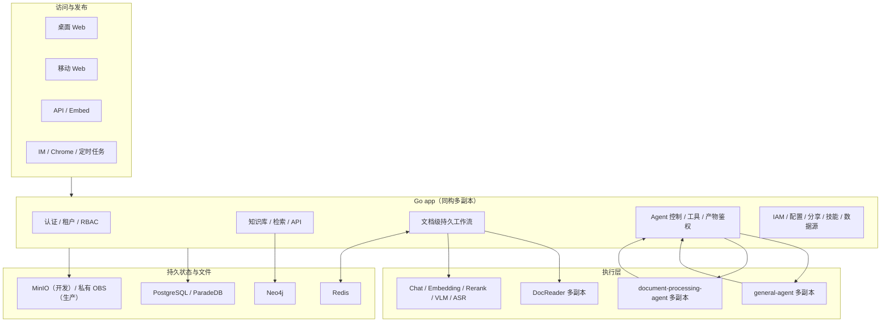

# WeKnora 系统介绍说明

> 当前实现交付版，更新日期：2026-08-06。
> 本文面向业务负责人、架构师、开发和运维，说明系统已经具备的能力和边界。
> 更细的代码/状态机/生产配置见
> [当前实现架构与文档索引](./当前实现架构与文档索引.md)。
> 生产实际拓扑、资源、模型和发布约束见
> [当前生产实现与部署基线](./当前生产实现与部署基线.md)。

## 1. 系统定位

WeKnora 是企业知识与智能体平台。它以知识库为可信信息底座，把资料入库、文档
理解、检索问答、数据分析、办公文件生成、企业权限和多渠道发布连接起来。

平台解决四类问题：

| 目标 | 能力 |
|---|---|
| 让企业资料可用 | 文档、FAQ、Wiki、向量、关键词、图谱、来源引用 |
| 让大量资料可处理 | 文档级持久队列、同构多实例、故障恢复、大文件拆分 |
| 让智能体完成业务任务 | 问答、推理、数据、表格、通用、Word/Excel/PDF/PPT |
| 让生产可治理 | 多租户、RBAC、SSO、共享、审计、私有对象存储、部署与迁移 |

## 2. 当前主要能力

### 2.1 企业知识库

- 文档知识库、FAQ、Wiki 页面和文件夹。
- 文件、文件夹、URL、手工 Markdown 和外部数据源入库。
- PDF、Word、Excel、PPT、文本、网页、图片、音频等格式。
- 向量检索、关键词检索、Rerank、父子分块、FAQ 优先。
- 摘要、问题生成、实体/关系抽取、Wiki 页面与链接图。
- 图片 VLM 理解、扫描 PDF OCR/VLM、音频 Omni 转写；旧 Qwen ASR 1.7B 已下架。
- 标签、完整状态筛选、排队位置、重建、取消和完整删除。

### 2.2 智能体

| 类型 | 主要用途 |
|---|---|
| 快速问答 | 制度、手册和知识库问答，强调来源 |
| 简单对话 | 通用写作、临时图片/音频/附件 |
| 智能推理 | 多步推理、知识、工具、MCP、Web |
| Wiki 问答 | 页面化知识、目录与关联阅读 |
| 数据分析 | MySQL/PostgreSQL 只读分析、指标和图表 |
| 表格分析 | CSV/Excel 知识库或本轮附件 |
| 通用智能体 | 知识、数据库、MCP、技能、Web 和产物组合 |
| 文档处理 | Word、Excel、PDF、PPT 生成、修改和转换 |

### 2.3 企业治理和发布

- 多租户、viewer/contributor/admin/owner 权限。
- 系统管理员和租户管理员分离。
- 共享空间、知识库/智能体/技能/数据源共享。
- 企业 SSO、组织人员同步和移动端同域回跳。
- 默认配置中心、模型/解析器/向量库/存储/MCP 下发。
- Web、移动 Web、REST API、Embed、IM、Chrome 扩展和定时任务。

## 3. 总体架构



架构的关键原则：

1. 每个 app 都能执行一份文档的完整流程，不按 Wiki、向量等任务类型拆成专用 app。
2. PostgreSQL 是文档工作流事实来源；Redis 是投递、流状态和集群模型准入。
3. Go app 是权限、租户、工具、业务数据库、MCP 和持久化控制边界。
4. Python Agent 只负责 SDK 推理循环和本次运行的临时文件。
5. 生产长期文件进入私有 OBS，不依赖 RWX 或某个 Pod 的本地目录。

## 4. 文档处理架构

### 4.1 完整流程


外层按文档排队。假设 500 份文档同时进入，生产三个 app、每实例完整文档并发 4，
最多有 12 份完整工作流同时推进。实例先完成就继续领取全局等待文档；不会先把
500 份都做完主解析，再让全部 Wiki/图谱堆在最后。

### 4.2 完成语义

“已完成”必须满足：

- 主解析完成。
- chunk 已写入；启用的向量和关键词索引可用。
- 适用且启用的 VLM/ASR 完成。
- 摘要完成。
- 问题生成和图谱抽取批任务完成。
- Wiki 页面、引用和队列完成。
- 没有 pending/running/finalizing 子任务。

`none` 是衍生状态初始值。在文档仍等待或前置解析未完成时，它表示“尚未开始”，
不是“已跳过”。只有功能关闭、内容不适用或任务记录明确跳过原因时才显示跳过；
执行异常必须失败或降级。

### 4.3 故障恢复

- Redis/Asynq 允许 at-least-once 投递。
- generation、stable task ID、boot ID、execution epoch 和幂等提交隔离重复/迟到
  结果。
- 同一稳定实例重启可以识别上次 boot 并继续工作。
- 心跳超时不能单独触发跨实例接管。
- 租约、boot/epoch fencing 和精确容器终止/节点隔离证明满足后，其他 app 才接管。
- 解析中删除或重建会隔离旧 generation，并清理或拒绝迟到写入。

## 5. 大文档和多模态

### 5.1 两层大小边界

- 对外知识源原文件：最大 2048 MiB。
- frontend/mobile/Ingress 知识路由：2304 MiB，给 multipart 元数据留余量。
- 单次 DocReader 传输：50 MiB。
- 超大知识文件：先按格式拆分，再逐部分解析并发布为一个逻辑文档。

拆分支持 PDF 页、Office 转 PDF/页或表格窗口、文本/Markdown 语义边界、JSON
有效记录、网页资源、图片切片和音频时间窗口。任务受到 part 数、膨胀比、窗口、
租约、重试和超时保护。

### 5.2 VLM 和音频

- 图片和扫描页可使用知识库配置的 Qwen 等 VLM。
- 音频统一使用平台下发的 Qwen2.5-Omni-7B；旧 Qwen ASR 1.7B 不再可选。
- 转写/理解结果进入 chunk、向量、摘要和后续衍生。
- VLM/Omni 各自有集群并发，排队不会被标记为跳过。

## 6. 集群容量与模型准入

### 6.1 文档执行

```text
parse-worker 副本                3
每 parse-worker 完整文档并发     4
集群完整文档容量                 12
每 DocReader gRPC worker         4
DocReader 总 parser worker       12
derivative consumer              2 × 18 = 36
Wiki consumer                    2 × 6 = 12
```

`asynq.concurrency` 是每 parse-worker 的完整文档并发，不是模型总并发。

### 6.2 模型集群总量

| 资源 | 集群并发 | 单租户 | 单文档/等待 |
|---|---:|---:|---:|
| Qwen3.6-27B | 32 | 32 | 文档 2、聊天等待 36 |
| DeepSeek-V4-Flash INT8 | 16 | 16 | 文档 2、聊天等待 16 |
| Qwen3.6-35B-A3B | 32 | 32 | 文档 4 |
| Embedding | 64 | 32 | 文档 8 |
| Rerank | 64 | 64 | 文档 2 |
| VLM | 16 | 16 | 文档 4 |
| Omni | 8 | 8 | 文档 2 |

两个主要聊天池合计执行 48、等待 52、接纳 100。模型准入由 Redis 在集群共享，
不能随三个 API 或 worker 副本乘大。

## 7. 存储架构

| 数据 | 开发 | 生产 | 持久性 |
|---|---|---|---|
| 原始知识文件 | MinIO | 私有 OBS | 持久 |
| 解析衍生对象 | MinIO | 私有 OBS | 持久 |
| Agent 最终产物 | MinIO | 私有 OBS | 持久、鉴权 |
| Agent 原文件中转 | 临时前缀 | 临时 OBS 前缀 | 清理 + ≤24h 兜底 |
| app/DocReader 工作区 | 本地临时盘 | 每 Pod RWO | 可丢弃 |
| Agent Office/Python 工作区 | 本地临时盘 | 每 Pod RWO | 可丢弃 |
| 状态、chunk、向量、问题、Wiki | PostgreSQL | PostgreSQL | 持久 |
| 实体关系 | Neo4j | Neo4j | 持久 |

三个对象用途使用互不重叠的用途标记、deployment 和 namespace UUID 前缀。对象
默认私有，键中不放用户名、原文件名或业务敏感名称。对象存储不能挂成 Office/PDF
随机读写的 POSIX 工作区。

## 8. Agent 架构

一次 Agent 运行的顺序：

1. app 校验用户、租户、Agent 和资源范围。
2. Agent Pod 在本地 RWO 目录运行 SDK。
3. 知识、数据库、MCP、Web 等工具回调 Go。
4. Agent 把最终产物上传 app。
5. app 写私有 MinIO/OBS，校验大小和 SHA256，落库 artifact ID。
6. 对象提交成功后才发送 terminal 事件。
7. 后续任意 app 可以鉴权下载或删除。

`general-agent` 和 `document-processing-agent` 均支持两个副本。单次运行不跨 Pod
共享半成品；Pod 在提交前故障时本轮失败/重试，不影响已持久产物。

## 9. 大数据量界面

- 文档卡片：简洁总状态、系统等待总量和当前文档位置。
- 悬停详情：解析、索引、多模态、摘要、问题/图谱和 Wiki。
- 筛选：等待、处理中、取消中、删除中、已完成、失败、已取消、草稿。
- 文件夹：服务端分页、搜索和渐进加载。
- 大文件预览：先查询 preview policy；大文件分页/范围读取或下载。
- Wiki 图：分类节点列表、搜索、有界概览、中心节点一跳图、邻居分页。
- 点击关联节点：把该节点设为新中心，加载它的关联图。

## 10. 生产拓扑

| 节点 | 规格 | 工作负载 |
|---|---|---|
| `10.14.201.1` | 8C/32Gi + 500G | API、parse、derivative、maintenance、DocReader、两个 Agent、Web |
| `10.14.201.2` | 8C/32Gi + 500G | API、parse、wiki、maintenance、DocReader、两个 Agent、Web |
| `10.14.201.7` | 8C/32Gi | API、parse、derivative、wiki、DocReader |
| `10.14.201.6` | 8C/16Gi | PostgreSQL 与集群基础设施，不新增应用 worker |
| `10.14.201.54` | 8C/16Gi | 现有 Neo4j、Ingress |

| 组件 | 副本 | request | limit | 临时卷 |
|---|---:|---:|---:|---:|
| API | 3 | 500m/1280Mi | 1500m/3Gi | 无状态 |
| parse-worker | 3 | 1C/2Gi | 3C/5Gi | hostPath scratch |
| derivative-worker | 2 | 500m/1Gi | 1500m/2Gi | hostPath scratch |
| wiki-worker | 2 | 500m/1Gi | 1500m/2Gi | hostPath scratch |
| maintenance | 2 | 150m/384Mi | 750m/1Gi | 无 |
| DocReader | 3 | 750m/1Gi | 4C/4Gi | hostPath scratch |
| general-agent | 2 | 250m/768Mi | 1500m/2Gi | hostPath scratch |
| document-processing-agent | 2 | 500m/1280Mi | 2500m/4Gi | hostPath scratch |
| frontend | 2 | 0.1C/128Mi | 0.5C/512Mi | 无 |
| mobile-web | 2 | 0.05C/64Mi | 0.3C/512Mi | 无 |

完整迁移、部署和回滚使用
[当前版本生产更新部署执行手册](./当前版本生产更新部署执行手册.md)。

## 11. 高可用边界

已经具备多副本：API、parse/derivative/wiki/maintenance、DocReader、两个 Agent、
frontend、mobile-web。

仍然存在：

- PostgreSQL 单实例。
- Neo4j 单实例。
- 外部 llmgateway 是独立共享依赖；集群内 LiteLLM 当前不承载模型流量。
- Redis 主从无自动切换。
- 单 AZ。

因此当前系统解决了文档执行层水平扩展、单 Pod/解析节点故障和无 RWX 文件共享，
不能宣称整套系统没有单点。

## 12. 当前验收基线

- “公司制度”632/632 文档完整完成。
- 7,871 chunks、13,267 embeddings、5,396 questions。
- 1,660 Wiki pages，引用覆盖全部 632 文档。
- Neo4j 20,008 nodes、13,765 relations。
- “数据资料”11/11、“全格式”27/27 完成。
- 500/500 文档负载约 4.10 docs/s。
- 匹配 100 文档：单 app 1.23、三 app 4.50 docs/s（本地 3.67×）。

以上是测试证据，不是生产 SLA。最终成功经过 PostgreSQL、向量、Neo4j、Wiki、
MinIO/OBS、前端状态和真实召回交叉核对。

## 13. 进一步阅读

- [根 README](../../README.md)
- [当前实现架构与文档索引](./当前实现架构与文档索引.md)
- [文档解析水平扩展与故障恢复](./文档解析水平扩展与故障恢复.md)
- [生产集群无 RWX 最优部署方案](./生产集群无RWX最优部署方案.md)
- [系统使用说明](./系统使用说明.md)
- [WeKnora 智能体能力使用文档](./WeKnora智能体能力使用文档.md)
