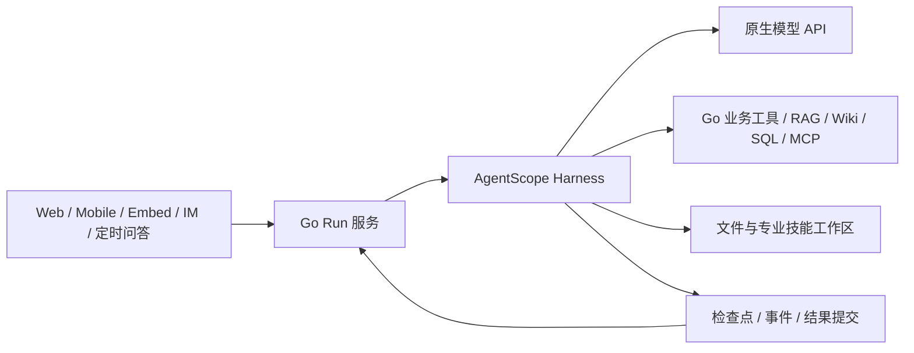

# 统一 Agent Harness 实现与验证

更新：2026-09-07。代码位于 `C:\weknora-agent-eval-loop`，分支 `codex/agent-eval-loop`。本次直接更新该工作树的现有开发环境；eval 仅指工作树，不使用旧 eval 评分或 gate 作为完成标准。

## 类型与预算

保留各类智能体的独立身份、入口、配置和能力，不合并为通用智能体。

| 类型 | 最大迭代 | 能力边界 |
|---|---:|---|
| 知识问答 `knowledge-qa` | 15 | 准确优先、结论明确、必要证据和引用；证据充分后结束，避免冗余检索 |
| 简单对话／自定义 | 50 | 通用对话与各自授权能力；不默认关联知识库时仍可读取本会话上传 |
| 通用智能体 | 50 | 检索、数据库、网页、MCP、轻量与专业技能、文件产物 |
| 数据分析 | 50 | 独立数据源绑定、只读 SQL、统计和图表 |
| 表格分析 | 50 | 上传／知识库 CSV、Excel、表格分析与交付 |
| 文档处理 | 50 | Word、Excel、PDF、PPT 生成、转换与模板 |
| Wiki／混合检索／知识库管理 | 50 | 保留各自检索、Wiki、管理权限和操作流程 |

快速问答的入口、配置、运行分支已经移除。原智能推理对外为“知识问答”，内置 ID 为 `builtin-knowledge-qa`。一次性数据清理仅处理退休 ID；其他类型不改成 general-agent。固定预算由后端规范化，前端只读展示，客户端不能提高上限。

## 单一运行链路

SDK 锁定 `agentscope==2.0.7.post1`，依赖由 `uv.lock` 固定。唯一 Agent 构造与 `reply_stream` 在 `custom/services/agent-runtime/app/run.py`。不再存在 Go ReAct、Claude Agent SDK、Claude Code CLI、旧 platform runtime 的问答循环。Go 保留身份、业务数据、检索和工具执行，返回执行结果，不控制另一条推理循环。使用 Claude 模型仍可通过原生 Anthropic 模型客户端；模型与 Agent SDK 是不同概念。

Python 代码按模型、预算、事件、交付、工作区等职责组织；Go 接合集中于 `internal/custom/modules/agentruntime`。专业技能使用 SDK 工作区；轻量技能由现有 skillhub 校验并装载，不再注册旧 Go 沙箱技能执行路径。解析、向量化、离线 Wiki 等仍由既有后台角色执行。

## 预算与完成语义

运行前及每次模型调用均提供最大预算、已使用和剩余迭代数。剩余 3 次进入收尾提示；最后一次禁用工具，保留给最终答案。迭代上限是上限，不是目标。

交付校验与提交优先于迭代结束错误：最后一次产生的有效最终答案仍可提交；恢复时已有有效答案不再调用模型。没有有效结果才产生 `incomplete`，不会把中途说明或工具执行前的文本当最终答案。模型执行结束后，纯代码交付阶段依据运行前的路径和哈希基线，仅发布本轮新增或修改且通过适用文件可用性校验的成品；持久化校验和消息提交不消耗模型迭代预算。详见[预算与产物交付](./统一运行预算与文件部分交付.md)。

Run 使用 PostgreSQL 所有权租约与 epoch、检查点、工具回执和 outbox。消息与最终结果原子提交。API 客户端断开不取消后台运行；用户主动停止会取消。Worker 重启可接管检查点，旧所有者不能再提交。无法确定是否完成的非幂等副作用不盲目重放。

## 准确性、速度与引用

知识问答采用简洁输出要求，但保留必要条件、例外和不确定性；用户要求详细分析时完整回答。显式证据范围可以预取，证据充分时一次模型调用完成。复用已验证历史证据，独立查询可并发，不另加规划、裁判或答案润色模型。

引用来自实际检索／读取片段，并绑定知识、片段、范围和快照；前端统一渲染。原文件工作区清单包含知识文档 ID，供模型取得对应的可引用原文；不伪造来源、不自动给无依据的句子插入引用。长会话提供事实记录与按需读取历史工具，避免只保留最近数轮。

聊天上传经会话私有知识库处理，复用现有解析与检索；不默认关联知识库的智能体仍保留服务端验证的当前及历史上传范围。知识库管理将这些上传视为输入来源，不扩张其增删改目标权限。修复了旧 DOC 转 DOCX 后格式提示仍为 DOC 导致表格单元格拼接的问题。

## 统一失败展示

共享分类定义在 `internal/custom/modules/usererrors/catalog.json`，Go、Python 与前端使用同一词表。类别涵盖空回复、内容过长、文件大小／格式／处理、权限、服务配置、繁忙、超时、未完成、连接、取消和兜底错误。界面仅展示简短中文说明；原始诊断留在运行记录。桌面、移动端、嵌入及 IM 共用该语义。文件或图表的有效交付不误判为空回复；普通无内容终态属于错误。

## 部署与运行

开发继续使用现有三 API、分角色后台及三 DocReader 编排；API `http://localhost:8080`，前端 `http://localhost:5177`，移动端 `/mobile/`。统一 Worker 使用 `custom/docker-compose.agent-runtime.yml`。工作区延迟创建，普通问答无需启动代码执行容器。

生产 Helm 使用 `agentRuntime` 与独立 `workspace` 镜像配置。工作区不携带模型或业务凭据，非 root 运行、网络隔离和资源限制；产物走私有对象存储与应用鉴权下载。构建、容量、拓扑与 Helm 校验脚本已调整。此次没有向实际生产集群推送或部署；Kubernetes 工作区仅完成静态与代码测试，不能据此宣称已通过真实集群运行验证。

## 已执行验证

验证脚本位于 `custom/tests/agent_runtime`，可检查报告位于开发工作树的 `.local-data/agent-runtime-validation`，这些含环境数据的报告不提交。

- Python Harness：42 项测试通过，覆盖预算末轮、空回复、有效最终提交、SDK 文件缓存、工作区限制及错误分类。
- Go：类型、应用服务、运行内核、内置配置、知识库管理、会话、IM、错误分类和配置包通过测试；实际 PostgreSQL 验证 11 项通过，包含类型不合并、绑定保留、幂等迁移、过期所有者、回执与原子提交。
- 前端：类型检查、308 项测试与生产构建通过；已在页面核对知识问答 15 次、数据分析 50 次及各独立类型。
- 公司制度知识库 598 份文档：18 轮话题切换和深度追问完整结束，覆盖专利、人才经费、风险制度，跨话题返回和授权前提更正；每轮 1–4 次模型调用，均有引用。该脚本验证运行与提交，关键金额及前提另行核对，不等同于所有制度判断均已人工评分。
- 简单对话、Wiki、数据分析、表格分析、文档处理均通过真实接口运行。数据分析统计由数据库独立复核：10 笔，原金额 4294.80、折扣 270.00、实付 3936.80。
- Word、PDF、两页 PPT 内容核对正确；PDF 已渲染检查。Excel 公式及缓存值复核为 36、16、52；产物大小、SHA256、私有下载校验通过。
- TXT、MD、JSON、DOCX、PDF、PPTX、CSV、XLSX、PNG、JPG、旧 DOC／PPT／XLS 以及混合多附件已测试。DOC 表格与 PPT 引用缺陷修复后回归通过。
- 超大聊天文件：PDF 133449940 字节、XLSX 133522846 字节，约为 128 MiB 上限的 99.4%；读取不同页／工作表并核对差值。128 MiB 加 1 字节被拒绝。未将聊天上传测试冒称为知识库 2 GiB 上限测试。
- 轻量技能、专业技能及组合调用通过；MCP、网页和本地 IM 接口模拟通过。没有向真实 IM 联系人发送测试消息。
- 知识库管理在一次性测试库完成新增、替换、删除：120 元变为 145 元，删除后库内文档为零；测试库与临时智能体已清理。
- WAV 音频转写及无重新上传的下一轮追问通过，预算 246→256、日期保持不变；当前音频回答有引用。
- 空回复、繁忙、超时、未知错误的模拟验证了流式与历史记录一致；Worker／API 重启、断连与取消已测试。

现有模型和检索仍可能给出不完全正确的答案，复杂跨制度分析也明显慢于简单问答。本次验证按用户要求逐场景检查是否正常、准确性与性能是否合理，不承诺每题正确或固定秒级完成。
