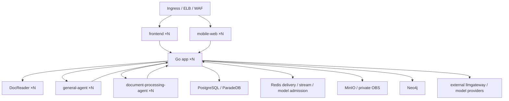

# WeKnora Helm Chart

[](https://artifacthub.io/packages/helm/weknora/weknora)
[](https://opensource.org/licenses/MIT)

Helm chart for deploying [WeKnora](https://github.com/Tencent/WeKnora) - an AI-powered Knowledge RAG Platform.

## Overview

WeKnora is an intelligent knowledge base platform that combines:
- Document parsing and understanding
- Vector search with BM25 hybrid retrieval
- LLM integration for conversational AI
- Multi-tenant support with encryption

## Prerequisites

- Kubernetes 1.25+
- Helm 3.10+
- PV provisioner support in the underlying infrastructure
- Ingress controller (nginx-ingress recommended) for external access

## Quick Start

```bash
# Add required secrets
helm install weknora ./helm \
  --namespace weknora \
  --create-namespace \
  --set secrets.dbPassword=<your-db-password> \
  --set secrets.redisPassword=<your-redis-password> \
  --set secrets.jwtSecret=<your-jwt-secret>
```

## Architecture



Each app replica owns complete document workflows. PostgreSQL is the durable
workflow source of truth; Redis/Asynq is an at-least-once delivery layer and
also hosts cluster-wide model admission. Agent tool execution and artifact
persistence return to Go; Python Agent Pods do not connect directly to the
WeKnora database, MCP services, business databases, or object-store credentials.

For the full state, storage, failure, and production topology, read
[`docs/custom/当前实现架构与文档索引.md`](../docs/custom/当前实现架构与文档索引.md).

## Installation

### Basic Installation

```bash
helm install weknora ./helm \
  --namespace weknora \
  --create-namespace \
  --set secrets.dbPassword=secure-password \
  --set secrets.redisPassword=secure-password \
  --set secrets.jwtSecret=$(openssl rand -base64 32)
```

### With Ingress

```bash
helm install weknora ./helm \
  --namespace weknora \
  --create-namespace \
  --set ingress.enabled=true \
  --set ingress.host=weknora.example.com \
  --set ingress.tls.enabled=true \
  --set ingress.tls.secretName=weknora-tls \
  --set secrets.dbPassword=secure-password \
  --set secrets.redisPassword=secure-password \
  --set secrets.jwtSecret=$(openssl rand -base64 32)
```

### With External LLM (Ollama)

```bash
helm install weknora ./helm \
  --namespace weknora \
  --create-namespace \
  --set app.extraEnv[0].name=OLLAMA_BASE_URL \
  --set app.extraEnv[0].value=http://ollama.ollama:11434 \
  --set app.extraEnv[1].name=INIT_LLM_MODEL_NAME \
  --set app.extraEnv[1].value=qwen2.5:7b \
  --set secrets.dbPassword=secure-password \
  --set secrets.redisPassword=secure-password \
  --set secrets.jwtSecret=$(openssl rand -base64 32)
```

### Production Installation

The repository contains one reviewed profile for the current production CCE:

- [`values-production-ha.yaml`](./values-production-ha.yaml): fixed topology,
  capacity, OBS namespaces, hostPath scratch, ingress limits, PDB and spread.
- [`deploy/production/values-site.example.yaml`](../deploy/production/values-site.example.yaml):
  copy to a protected workspace and replace SWR namespace/image SHA.
- [`deploy/production/values-migration.example.yaml`](../deploy/production/values-migration.example.yaml):
  one maintenance app for SQL and legacy-artifact migration.

Current production roles are API/parse-worker `3/3`, derivative/wiki/maintenance
`2/2/2`, DocReader `3`, general-agent/document-processing-agent `2/2`, and
frontend/mobile-web `2/2`. Every parse-worker admits four complete document
workflows; cluster document capacity is 12. Durable files use private OBS. Each
worker/DocReader/Agent Pod gets an isolated hostPath scratch directory under
`/mnt/weknora-data/weknora-v2-scratch`; no RWX volume is required.

The current production namespace is not an active Helm release that may be
adopted with `helm upgrade --install`. Render and validate this chart, then use a
reviewed, controlled apply. Never use namespace `--prune`, and never remove the
cluster ingress-nginx/controller. See
[`docs/custom/当前生产实现与部署基线.md`](../docs/custom/当前生产实现与部署基线.md).

Render and validate:

```bash
cp deploy/production/values-site.example.yaml /secure/values-site.yaml
# Replace every REPLACE_* token in the protected copy.

helm lint ./helm \
  -f helm/values-production-ha.yaml \
  -f /secure/values-site.yaml

helm template weknora ./helm -n weknora \
  -f helm/values-production-ha.yaml \
  -f /secure/values-site.yaml \
  > /secure/weknora-production.yaml

grep -n 'REPLACE_' /secure/weknora-production.yaml
kubectl apply --dry-run=server -f /secure/weknora-production.yaml
kubectl diff -f /secure/weknora-production.yaml
```

The existing production resources are not currently owned by an active Helm
release. For that environment, **do not run `helm upgrade --install`, do not
use `--prune`, and do not delete the existing PostgreSQL/Neo4j/Redis/model-gateway
Services or PVCs**. The in-cluster LiteLLM Deployment currently carries no
production model traffic. Follow the exact backup, drain, single-replica migration,
immutable-resource replacement, rollout,
acceptance, and rollback sequence in:

1. [`deploy/production/README.md`](../deploy/production/README.md)
2. [`当前版本生产更新部署执行手册`](../docs/custom/当前版本生产更新部署执行手册.md)
3. [`生产集群无 RWX 最优部署方案`](../docs/custom/生产集群无RWX最优部署方案.md)

For a genuinely new cluster with no existing resources or data, the rendered
profile may be installed as a Helm release after site-specific secrets,
storage classes, external database/Redis/Neo4j/model services, and object
prefixes have been independently reviewed.

## Configuration

### Global Parameters

| Parameter | Description | Default |
|-----------|-------------|---------|
| `global.storageClass` | Storage class for PVCs | `""` |
| `global.imagePullSecrets` | Image pull secrets | `[]` |
| `global.podSecurityContext` | Pod security context | See values.yaml |
| `global.containerSecurityContext` | Container security context | See values.yaml |

### ServiceAccount

| Parameter | Description | Default |
|-----------|-------------|---------|
| `serviceAccount.create` | Create ServiceAccount | `true` |
| `serviceAccount.name` | ServiceAccount name | `""` |
| `serviceAccount.annotations` | ServiceAccount annotations | `{}` |
| `serviceAccount.automountServiceAccountToken` | Automount a general token on every component (the app verifier uses a dedicated projected token instead) | `false` |

### App (Backend)

| Parameter | Description | Default |
|-----------|-------------|---------|
| `app.enabled` | Enable backend | `true` |
| `app.replicaCount` | Number of replicas | `1` |
| `app.updateStrategy` | Deployment rollout strategy; use no-surge replacement for large local scratch PVCs | `RollingUpdate, surge 1` |
| `app.image.repository` | Image repository | `wechatopenai/weknora-app` |
| `app.image.tag` | Image tag | `""` (uses appVersion) |
| `app.sandbox.mode` | One-shot skill sandbox mode | `docker` |
| `app.sandbox.timeoutSeconds` | Sandbox execution timeout | `"60"` |
| `app.sandbox.dockerImage` | Image pulled by the host Docker daemon in docker mode | `wechatopenai/weknora-sandbox:latest` |
| `app.resources` | Resource limits | See values.yaml |
| `app.env` | Environment variables | See values.yaml |
| `app.extraEnv` | Additional env vars | `[]` |
| `app.extraVolumes` / `app.extraVolumeMounts` | Mount external database/Redis CA or mTLS Secrets | `[]` |
| `app.connections.database.ssl.mode` | PostgreSQL TLS mode; use `verify-full` in production | `disable` |
| `app.connections.database.ssl.rootCertFile` | Mounted PostgreSQL CA path | `""` |
| `app.connections.database.ssl.certFile` / `keyFile` | Optional PostgreSQL mTLS identity | `""` |
| `app.connections.redis.tls.enabled` | Enable TLS for Redis | `false` |
| `app.connections.redis.tls.caFile` | Mounted Redis CA path | `""` |
| `app.connections.redis.tls.certFile` / `keyFile` | Optional Redis mTLS identity | `""` |
| `app.connections.redis.tls.serverName` | Redis certificate DNS name | `""` |
| `app.documentQueue.kubernetesRuntimeVerifier.enabled` | Verify exact terminated Pod UIDs before automatic cross-Pod takeover | `true` |
| `app.documentQueue.kubernetesRuntimeVerifier.containerName` | App container whose current terminated state is authoritative | `app` |
| `app.env.AUTO_MIGRATE` | Run base SQL migrations at startup; production should enable it only on one isolated maintenance replica | `"true"` |
| `app.env.WEKNORA_ASYNQ_CONCURRENCY` | Complete document workflows admitted per app replica (runtime System Admin setting takes precedence) | `"4"` |
| `app.env.WEKNORA_WIKI_MAP_TASK_CONCURRENCY` | Document-local Wiki Map consumers per app replica, isolated from ordinary derivatives | `"4"` |

The app replicas share one durable PostgreSQL document-workflow outbox and one
Redis delivery queue. Scaling `app.replicaCount` adds complete document workers;
idle replicas claim globally waiting documents. A process restart with the same
pod identity resumes its leases, while an expired lease from a failed/replaced
pod is reassigned only after the delivery is confirmed inactive and the old
boot has a runtime-backed termination proof. A normal SIGTERM publishes that
proof after local handlers drain; an in-Pod container restart keeps the Pod UID
and atomically adopts the old boot. By default, healthy replicas use a narrowly
scoped projected service-account token to list Pods only in their namespace,
match the exact immutable UID encoded in `instance_id`, and accept only the
current `app` container's `terminated` state, including its immutable
`containerID` and `finishedAt`. A terminal Pod phase by itself is not accepted. A
`deletionTimestamp`, missing UID/404, heartbeat age, or lease expiry is never
termination proof. When Kubernetes cannot retain an explicit terminal status
(notably some node-partition/forced-deletion cases), fence the node/runtime and
use the SystemAdmin-only
`POST /api/v1/custom/document-queue/instances/termination-attestation` endpoint
with the exact old `instance_id` and `boot_id`. Do not use pod-local file
storage with multiple replicas.

Every app replica also consumes the isolated `wiki_map` lane. Its per-replica
consumer count scales with app replicas, while shared Redis model admission
still caps aggregate provider/model/tenant concurrency. Keeping this lane
separate prevents a large Wiki backlog from occupying the generic derivative
worker pool.

### DocReader

| Parameter | Description | Default |
|-----------|-------------|---------|
| `docreader.enabled` | Enable document parser | `true` |
| `docreader.replicaCount` | Number of parser replicas | `1` |
| `docreader.updateStrategy` | Deployment rollout strategy | `RollingUpdate, surge 1` |
| `docreader.service.headless` | Expose all parser endpoints for gRPC round-robin | `true` |

For worker high availability, run at least two app replicas and two DocReader
replicas across failure domains, with disruption budgets enabled. PostgreSQL,
Redis, object storage and the selected vector/graph/model
providers must also use their own HA deployments; worker scaling does not make
those external dependencies highly available. The production profile retains
the currently supplied internal plaintext endpoints; if the site security
baseline requires encrypted east-west traffic, provide the real TLS endpoints
and CA Secrets and switch PostgreSQL/Redis to verified TLS rather than using
`insecureSkipVerify`.

### Custom Agent Services

| Parameter | Description | Production value |
|---|---|---:|
| `generalAgent.replicaCount` | General/data/table/KB-manager runtime Pods | `2` |
| `generalAgent.scratch` | Per-Pod POSIX run workspace | `20Gi` RWO ephemeral |
| `documentProcessingAgent.replicaCount` | Office document runtime Pods | `2` |
| `documentProcessingAgent.scratch` | Per-Pod Office/PDF workspace | `40Gi` RWO ephemeral |
| `app.agentIntegration.artifactStorage.provider` | Durable final artifacts | `obs` |
| `app.agentIntegration.artifactStorage.pathPrefix` | Private deployment/namespace-scoped artifact root | unique production prefix |

One SDK run stays in one Agent Pod. Before terminal completion, final artifacts
are uploaded to the Go internal endpoint and committed to private object
storage with size/SHA verification. Agent scratch is disposable; it must not
be an OBS/S3 mount or RWX share. Any proxy on the internal artifact route must
allow at least 128 MiB.

### Frontend

| Parameter | Description | Default |
|-----------|-------------|---------|
| `frontend.enabled` | Enable frontend | `true` |
| `frontend.replicaCount` | Number of replicas | `1` |
| `frontend.image.repository` | Image repository | `wechatopenai/weknora-ui` |
| `frontend.image.tag` | Image tag | `latest` |
| `frontend.maxFileSizeMB` | Raw ordinary-file limit exposed to the UI | `50` |
| `frontend.maxKnowledgeSourceFileSizeMB` | Raw knowledge-source limit exposed to the UI | `2048` |
| `frontend.proxyMaxBodySizeMB` | Nginx ordinary request-body ceiling including transport overhead | `80` |
| `frontend.proxyMaxKnowledgeSourceBodySizeMB` | Nginx knowledge request-body ceiling including transport overhead | `2304` |
| `frontend.proxyTimeoutSeconds` | Nginx API read/send timeout | `3600` |

### Mobile Web

When `mobileWeb.enabled=true`, the chart creates a `mobile-web` Deployment/Service
and adds an Ingress path `/mobile` before the desktop frontend catch-all. The
mobile image must be built from `frontend/Dockerfile.mobile`; it serves the SPA
under `/mobile/` and static assets under `/mobile/assets/`.

Chat share links use the shared path `/share/chat/:token`. In the default chart
Ingress, `/share/` is handled by the desktop frontend catch-all and the page
switches between desktop and mobile layouts by viewport. If you customize the
Ingress to route `/share/` to `mobile-web` instead, also route `/assets/` to
`mobile-web`; the mobile image includes the desktop SPA at `/` specifically for
that deployment shape. Set the app env `FRONTEND_BASE_URL` to the public origin
if the create-share API should return absolute URLs; otherwise it returns a
host-relative `/share/chat/:token` path.

| Parameter | Description | Default |
|-----------|-------------|---------|
| `mobileWeb.enabled` | Enable mobile web mounted at `/mobile/` | `false` |
| `mobileWeb.replicaCount` | Number of replicas | `1` |
| `mobileWeb.image.repository` | Image repository | `weknora-mobile-web` |
| `mobileWeb.image.tag` | Image tag | `local` |
| `mobileWeb.service.port` | Service port | `80` |
| `mobileWeb.appHost` | Backend app service host | `app` |
| `mobileWeb.appPort` | Backend app service port | `8080` |
| `mobileWeb.proxyMaxBodySizeMB` | Nginx ordinary request-body ceiling including transport overhead | `80` |
| `mobileWeb.proxyMaxKnowledgeSourceBodySizeMB` | Nginx knowledge request-body ceiling including transport overhead | `2304` |
| `mobileWeb.proxyTimeoutSeconds` | Nginx API read/send timeout | `3600` |

### PostgreSQL (ParadeDB)

| Parameter | Description | Default |
|-----------|-------------|---------|
| `postgresql.enabled` | Enable PostgreSQL | `true` |
| `postgresql.image.repository` | Image repository | `paradedb/paradedb` |
| `postgresql.image.tag` | Image tag | `v0.18.9-pg17` |
| `postgresql.persistence.enabled` | Enable persistence | `true` |
| `postgresql.persistence.size` | PVC size | `10Gi` |

### Redis

| Parameter | Description | Default |
|-----------|-------------|---------|
| `redis.enabled` | Enable Redis | `true` |
| `redis.image.repository` | Image repository | `redis` |
| `redis.image.tag` | Image tag | `7-alpine` |
| `redis.persistence.enabled` | Enable persistence | `true` |
| `redis.persistence.size` | PVC size | `1Gi` |

### Uploaded File Storage

| Parameter | Description | Default |
|-----------|-------------|---------|
| `dataFiles.persistence.enabled` | Persist uploaded files | `true` |
| `dataFiles.persistence.size` | PVC size | `10Gi` |
| `dataFiles.persistence.accessModes` | PVC access modes | `[ReadWriteOnce]` |

### Ingress

| Parameter | Description | Default |
|-----------|-------------|---------|
| `ingress.enabled` | Enable ingress | `false` |
| `ingress.className` | Ingress class | `nginx` |
| `ingress.host` | Hostname | `weknora.example.com` |
| `ingress.tls.enabled` | Enable TLS | `false` |
| `ingress.tls.secretName` | TLS secret name | `""` |

### Secrets

| Parameter | Description | Default |
|-----------|-------------|---------|
| `secrets.dbUser` | Database username | `postgres` |
| `secrets.dbPassword` | Database password | `""` (required) |
| `secrets.dbName` | Database name | `weknora` |
| `secrets.redisPassword` | Redis password | `""` (required) |
| `secrets.jwtSecret` | JWT signing secret | `""` (required) |
| `secrets.existingSecret` | Use existing secret | `""` |

### Optional Components

These map to docker-compose profiles:

| Parameter | Description | Default |
|-----------|-------------|---------|
| `minio.enabled` | Enable MinIO storage | `false` |
| `neo4j.enabled` | Enable Neo4j (GraphRAG) | `false` |
| `qdrant.enabled` | Enable Qdrant vector DB | `false` |

## Security Best Practices

### Secret Management

**Never commit secrets to Git!** Use one of these approaches:

1. **Helm --set flags** (for testing)
   ```bash
   helm install weknora ./helm --set secrets.dbPassword=xxx
   ```

2. **External Secrets Operator** (recommended for production)
   ```yaml
   secrets:
     existingSecret: weknora-external-secret
   ```

3. **Sealed Secrets** (for GitOps)
   ```bash
   kubeseal < secret.yaml > sealed-secret.yaml
   ```

### Pod Security

The chart follows CNCF security best practices:
- Runs as non-root user
- Read-only root filesystem where possible
- Drops all capabilities
- Uses seccomp profiles

## Upgrading

For an ordinary Helm-owned installation:

```bash
helm upgrade weknora ./helm \
  --namespace weknora \
  -f values-production.yaml
```

Avoid `--reuse-values` when chart defaults or required security/storage fields
changed; render and diff the complete effective values instead. The current
production CCE is a migration from unmanaged resources and must use the
dedicated execution runbook above, not this generic command. Run SQL/data
migrations on exactly one maintenance app; all serving app replicas use
`AUTO_MIGRATE=false`.

## Uninstalling

```bash
helm uninstall weknora --namespace weknora

# Optional: Remove PVCs
kubectl delete pvc -n weknora -l app.kubernetes.io/instance=weknora
```

## Troubleshooting

### Check Pod Status
```bash
kubectl get pods -n weknora
```

### View Logs
```bash
# Backend logs
kubectl logs -n weknora -l app.kubernetes.io/component=app -f

# Frontend logs
kubectl logs -n weknora -l app.kubernetes.io/component=frontend -f
```

### Common Issues

**Pod stuck in Pending**
- Check if PVCs are bound: `kubectl get pvc -n weknora`
- Verify storage class exists: `kubectl get sc`

**Connection refused errors**
- Wait for all pods to be Ready
- Check service endpoints: `kubectl get endpoints -n weknora`

**Database connection errors**
- Verify secrets are correct
- Check PostgreSQL logs: `kubectl logs -n weknora -l app.kubernetes.io/component=database`

**Knowledge uploads return 413**
- The raw backend knowledge-source limit is 2048 MiB.
- Frontend/mobile Nginx and Ingress must allow 2304 MiB, request buffering must
  be off, and read/send timeouts must be 7200 seconds.
- Check cloud ELB/WAF as well; a default 1 MiB limit in any layer fails before
  the request reaches app.
- Internal Agent artifact proxies need at least 128 MiB; ordinary user
  attachments still use the 50 MiB business limit.

**A failed app is not immediately taken over**
- Heartbeat or lease expiry is not sufficient proof that an old process cannot
  still write. Check boot/epoch, the exact Kubernetes container termination
  verifier, and node fencing. Use the SystemAdmin termination-attestation API
  only after the exact old boot is proved stopped.

## Contributing

See [CONTRIBUTING.md](https://github.com/Tencent/WeKnora/blob/main/CONTRIBUTING.md) in the main repository.

## References

This Helm chart follows best practices from:
- [Helm Best Practices](https://helm.sh/docs/chart_best_practices/)
- [ArgoCD Helm Chart](https://github.com/argoproj/argo-helm)
- [Prometheus Helm Charts](https://github.com/prometheus-community/helm-charts)
- [cert-manager Helm Chart](https://github.com/cert-manager/cert-manager)

## License

This chart is licensed under the MIT License - see the [LICENSE](https://github.com/Tencent/WeKnora/blob/main/LICENSE) file for details.
